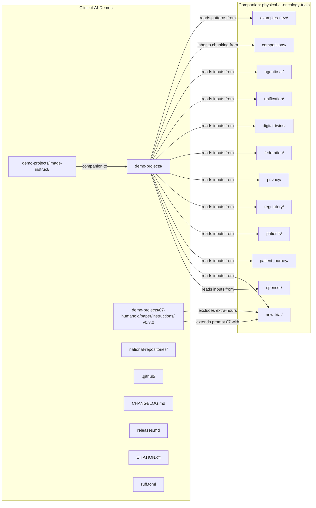
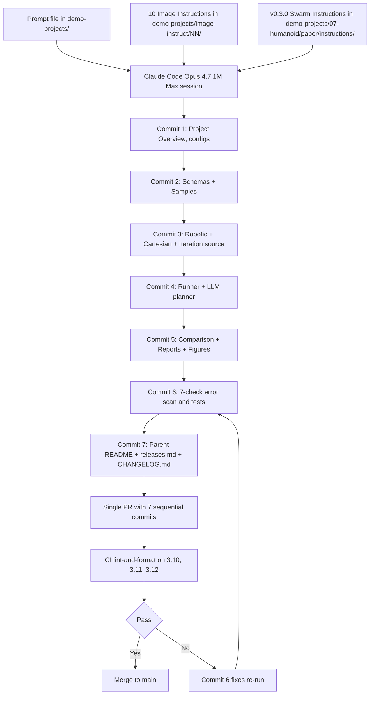

# Clinical-AI-Demos

[](https://opensource.org/licenses/MIT)
[](https://github.com/kevinkawchak/Clinical-AI-Demos)
[](https://github.com/kevinkawchak/Clinical-AI-Demos)
[](https://github.com/kevinkawchak/physical-ai-oncology-trials)
[](https://doi.org/10.5281/zenodo.18445179)
[](https://doi.org/10.5281/zenodo.18029100)
[](https://www.python.org/)
[](releases.md)

**Demonstrations regarding humanoid agents and large language models for Physical AI oncology clinical trials, by Claude Code Opus 4.7; with assistance from kevinkawchak/physical-ai-oncology-trials.**

This repository delivers self-contained task brief prompts that downstream Claude Code Opus 4.7 1M Max sessions execute to author Physical AI oncology clinical trial demonstrations. Every demo centers on humanoid agents performing surgical and patient care tasks inside clinical trial sites.

**5/17: v0.3.0 (3-Robot Camarade Swarm Instructions for Demo Prompt 07)** *Detailed code generation instructions for the 24/7 adverse event response demo, emphasizing 3 H2 humanoids per site as a swarm, broadcast publish-subscribe, peer 60 GHz UWB plus IR beacon physical communication, shared on-prem Claude Code compute fabric for intellectual communication, and the camarade pattern that reduces single robot error potential.* [](https://github.com/kevinkawchak/Clinical-AI-Demos/tree/main/demo-projects/07-humanoid/paper/instructions)

**5/17: v0.2.0 (100 Image Instructions for the 10 Demo Prompts)** *Ten image instructions per prompt distributed 3 landscape full-page plus 7 portrait (value proposition canvas, financial waterfall, capability radar, sankey flow, process funnel, strategic quadrant, decision tree).* [](https://github.com/kevinkawchak/Clinical-AI-Demos/tree/main/demo-projects/image-instruct)

**5/16: v0.1.0 (Humanoid + LLM Oncology Trial Demo Prompts)** *Ten standalone prompts spanning trial site operations, sponsor center, pharmacy compounding, recovery nursing, pathology lab, tele-surgery, AE response, research coordinator, radiation oncology, decentralized home care.* [](https://github.com/kevinkawchak/Clinical-AI-Demos/tree/main/demo-projects)

> **v0.3.0** - Third release. Demo 07 (Humanoid 24/7 Adverse Event Response) extended with multi-robot synergy. The new code generation instructions in `demo-projects/07-humanoid/paper/instructions/` define swarm behavior between 3 robots per site, physical communication via 60 GHz UWB and IR beacon, intellectual communication via the on-prem shared Claude Code compute fabric, one broadcast tick sent simultaneously to all 3 robots per site, and a peer-aware adapter that treats other robots as first-class actors. 12 H2 humanoids across the 4 PAT-NET-001 sites (San Francisco, San Diego, Boston, Atlanta), 3 per site. Cites the author's prior FAERS LLM paper at DOI 10.5281/zenodo.18029100 as the precedent for LLM-driven adverse event work.
>
> **v0.2.0** - Second release. 100 image instructions for the 10 prompts (10 per prompt: 3 landscape full-page plus 7 portrait), shared color palette and DejaVu Sans typography, matplotlib-only Python script conventions, single-dashes-only and section-sign § rules, white background facecolor.
>
> **v0.1.0** - First release. 10 humanoid + LLM oncology trial demo prompts, complete repository scaffolding (CI workflow for Python 3.10/3.11/3.12, ruff and yamllint configuration, governance files), national-repositories meta-prompting guide carried forward from the initial commit history.

## Responsible Use

This repository is a complementary open-source resource, please implement code safely and responsibly. Intended audience: engineers, clinicians, and clinical trial operations teams building humanoid + LLM systems (Atlas, Optimus, Figure, Digit, Phoenix, Apollo, Neo, H2 humanoids; Claude, GPT, Gemini, Ollama, GR00T LLMs) for oncology clinical trial deployments.

## Quick Start

```bash
# Clone the repository
git clone https://github.com/kevinkawchak/Clinical-AI-Demos.git
cd Clinical-AI-Demos

# Inspect the 10 demo prompts
ls demo-projects/

# Inspect the 100 image instructions (10 per prompt)
ls demo-projects/image-instruct/

# Inspect the v0.3.0 swarm instructions for prompt 07
ls demo-projects/07-humanoid/paper/instructions/

# Install lint tools to verify CI cleanliness
pip install ruff yamllint
ruff check .
ruff format --check .
yamllint -d relaxed .github/

# Read the meta-prompting guide
less national-repositories/build-national.md

# To execute a prompt, also clone the companion repository
git clone https://github.com/kevinkawchak/physical-ai-oncology-trials.git ../physical-ai-oncology-trials
```

## Humanoid + LLM Demo Prompts (v0.1.0) plus Image Instructions (v0.2.0) plus Swarm Instructions (v0.3.0)

```
  Clinical-AI-Demos       Future Claude Code           Output Tree
  prompt + image     -->  Opus 4.7 1M Max         -->  under demo-
  instructions in         reads prompts + image        projects/NN-
  demo-projects/          instructions + swarm         *-output/ or
  and image-instruct/     instructions from            07-humanoid/
  and 07-humanoid/        companion repo               paper/instructions/
  +-----------------+    +-----------------------+    +----------------+
  | 01 Site Dir     |--> | Read prompt + 10      |--> | 7 commits in   |
  | 02 Sponsor      |    | image instructions    |    | 1 PR with the  |
  | 03 Pharmacy     |    | for that prompt       |    | 3-layer chunk  |
  | 04 Recovery     |    | plus swarm instr      |    | strategy from  |
  | 05 Pathology    |    | plus companion repo   |    | companion repo |
  | 06 Tele-Surg    |    | inputs                |    +----------------+
  | 07 AE Response  |    +-----------------------+              |
  | + camarade      |               |                           |
  |   swarm v0.3.0  |               v                           |
  | 08 CRC          |    +-----------------------+              |
  | 09 RadOnc       |    | Author matplotlib     |              |
  | 10 Home DCT     |    | scripts plus swarm    |              |
  +-----------------+    | code; emit 300 dpi    |              |
           |             | PNG outputs and       |              v
           v             | parquet, jsonl, etc.  |
  +-----------------------------------------------------------------+
  | v0.3.0 of Clinical-AI-Demos delivers code generation            |
  | instructions for the demo 07 3-robot camarade swarm. The 4-site |
  | PAT-NET-001 network. 12 H2 humanoids total (3 per site). One    |
  | LLM broadcast per tick to all 3 robots; 60 GHz UWB plus IR      |
  | beacon physical comms; shared on-prem Claude Code compute       |
  | fabric for intellectual comms; peer-aware adaptation to         |
  | patients, doctors, and other robots.                            |
  +-----------------------------------------------------------------+
```

## Humanoid Coverage (v0.1.0 + v0.2.0 + v0.3.0)

```
  Humanoid Platform               Per-Demo Mapping               LLM Backend
  +------------------------+      +-----------------------+      +------------+
  | Boston Dynamics        |  ->  | 01 Site Operations    |  ->  | Claude     |
  | Atlas Electric         |      | 09 Rad Onc (paired)   |      | Opus 4.7   |
  | 28 DOF, 1.5 m, 89 kg   |      |                       |      | 1M on-prem |
  +------------------------+      +-----------------------+      +------------+
  | Tesla Optimus Gen 3    |  ->  | 02 Sponsor Center 5x  |  ->  | Sonnet 4.6 |
  | 43 DOF, 1.73 m, 57 kg  |      | 09 Rad Onc (paired)   |      | + Opus     |
  +------------------------+      +-----------------------+      +------------+
  | Figure 03              |  ->  | 03 Pharmacy CAR-T     |  ->  | GPT-5.5    |
  | 32 DOF, 1.68 m, 60 kg  |      | 10 Home DCT (Field)   |      | Haiku 4.5  |
  +------------------------+      +-----------------------+      +------------+
  | Agility Digit V5       |  ->  | 04 Recovery Room PACU |  ->  | Claude     |
  | 16 DOF, 1.8 m, 80 kg   |      |                       |      | + Llama 4  |
  +------------------------+      +-----------------------+      +------------+
  | Sanctuary Phoenix Gen 8|  ->  | 05 Pathology Lab CAP  |  ->  | Gemini 3   |
  | 24 DOF/hand, 1.7 m     |      |                       |      |+ Qwen 3    |
  +------------------------+      +-----------------------+      +------------+
  | Apptronik Apollo       |  ->  | 06 Tele-Surgical      |  ->  | Claude     |
  | 40 DOF, 1.73 m, 73 kg  |      | 1,100-mile rural site |      | + Operator |
  +------------------------+      +-----------------------+      +------------+
  | 1X Neo Beta            |  ->  | 08 Clinical Research  |  ->  | Multi-     |
  | 28 DOF, 1.65 m, 35 kg  |      | Coordinator, 5 langs  |      | Model      |
  +------------------------+      +-----------------------+      +------------+
  | Unitree H2 (3 per site)|  ->  | 07 4-Site AE Response |  ->  | Per-site   |
  | 39 DOF, 1.8 m, 70 kg   |      | 12 H2 total in v0.3.0 |      | Claude     |
  | swarm camarade         |      | 3-robot camarade x 4  |      | broadcast  |
  +------------------------+      +-----------------------+      +------------+
```

## Repository Structure

```
Clinical-AI-Demos/
├── README.md                                    # This file
├── CHANGELOG.md                                 # Keep a Changelog format
├── releases.md                                  # Release notes archive
├── LICENSE                                      # MIT License
├── CITATION.cff                                 # Citation metadata
├── CONTRIBUTING.md                              # Contribution guide
├── CODE_OF_CONDUCT.md                           # Contributor Covenant v2.1
├── SECURITY.md                                  # Security policy
├── SUPPORT.md                                   # Support and humanoid vendor links
├── ruff.toml                                    # Ruff linter and formatter config
├── .gitignore
│
├── .github/
│   ├── workflows/
│   │   └── ci.yml                               # CI lint-and-format on 3.10, 3.11, 3.12
│   ├── ISSUE_TEMPLATE/
│   │   ├── bug_report.md
│   │   └── feature_request.md
│   └── PULL_REQUEST_TEMPLATE.md                 # Safety + CI checklist
│
├── demo-projects/                               # ★ v0.1.0 Ten Demo Prompts + v0.2.0 100 Image Instructions + v0.3.0 Swarm Instructions
│   ├── README.md                                # Directory README with coverage matrix
│   ├── 01-humanoid-site-operations-director.md  # Atlas Electric + Claude Opus 4.7
│   ├── 02-sponsor-humanoid-operations-center.md # 5x Optimus + Sonnet/Opus failover
│   ├── 03-humanoid-pharmacy-imp-compounding.md  # Figure 03 + GPT-5.5 Thinking
│   ├── 04-humanoid-post-op-recovery-nurse.md    # Digit V5 + Claude/Llama 4
│   ├── 05-humanoid-biospecimen-pathology-lab.md # Phoenix Gen 8 + Gemini/Qwen via MCP
│   ├── 06-humanoid-tele-surgical-assistant.md   # Apollo + Claude + operator-in-loop
│   ├── 07-humanoid-24-7-adverse-event-response.md
│   ├── 07-humanoid/                             # ★ v0.3.0 Swarm Instructions for Prompt 07
│   │   └── paper/
│   │       ├── instructions/                    # Code generation instructions, 7 commit roadmap
│   │       │   ├── README.md                    # Comprehensive overview with badges, ASCII
│   │       │   ├── 00-project-overview/         # Architecture, swarm, thesis, memory, camaraderie
│   │       │   ├── 01-commit-roadmap/           # 7 commit roadmap, error scan, tests
│   │       │   ├── 02-config-instructions/      # 6 YAML config authoring instructions
│   │       │   ├── 03-schemas-instructions/     # 10 JSON Schema authoring instructions
│   │       │   ├── 04-robotic-instructions/     # Dispatcher, swarm, comms, robot loop
│   │       │   ├── 05-cartesian-instructions/   # Kinematics, sensor to xyz, planner, safety
│   │       │   ├── 06-iteration-instructions/   # Week runner, iterate, parquet, duckdb
│   │       │   ├── 07-llm-planner-instructions/ # LLM planner, broadcaster, grader, escalation
│   │       │   ├── 08-comparison-instructions/  # Comparison framework, report, figures
│   │       │   ├── 09-runtime-instructions/     # MacOS, Windows, Linux runtime guides
│   │       │   └── 10-repository-update-instructions/  # README, releases, CHANGELOG update guides
│   │       └── templates/                       # Reserved for future template files
│   ├── 08-humanoid-clinical-research-coordinator.md
│   ├── 09-humanoid-radiation-oncology-technologist.md
│   ├── 10-humanoid-decentralized-home-care.md   # Figure Field + Claude Haiku 4.5 edge
│   └── image-instruct/                          # ★ v0.2.0 100 image instruction MD files
│       ├── README.md                            # Image instruction directory README
│       ├── 01-site-operations-director/         # 10 instructions for prompt 01
│       ├── 02-sponsor-operations-center/        # 10 instructions for prompt 02
│       ├── 03-pharmacy-imp-compounding/         # 10 instructions for prompt 03
│       ├── 04-post-op-recovery-nurse/           # 10 instructions for prompt 04
│       ├── 05-biospecimen-pathology-lab/        # 10 instructions for prompt 05
│       ├── 06-tele-surgical-assistant/          # 10 instructions for prompt 06
│       ├── 07-adverse-event-response/           # 10 instructions for prompt 07
│       ├── 08-clinical-research-coordinator/    # 10 instructions for prompt 08
│       ├── 09-radiation-oncology-technologist/  # 10 instructions for prompt 09
│       └── 10-decentralized-home-care/          # 10 instructions for prompt 10
│
└── national-repositories/                       # Meta-prompting guidance (carried forward)
    └── build-national.md                        # Building National Repositories at Scale
```

## Mermaid: Repository Topology



## Mermaid: Demo Prompt + Image + Swarm Instruction Execution Loop



## Core Technologies (May 2026)

### Humanoid Platforms

| Platform | Vendor | DOF | Height | Mass | Payload | Primary Use in v0.1.0 to v0.3.0 |
|----------|--------|-----|--------|------|---------|---------------------------------|
| Atlas Electric | Boston Dynamics | 28 | 1.5 m | 89 kg | 11 kg/arm | Site director, RadOnc patient handler |
| Optimus Gen 3 | Tesla | 43 | 1.73 m | 57 kg | 9 kg/arm | Sponsor ops, RadOnc machine operator |
| Figure 03 | Figure AI | 32 | 1.68 m | 60 kg | 4 kg/arm | Pharmacy CAR-T compounding, home DCT |
| Digit V5 | Agility Robotics | 16 | 1.8 m | 80 kg | 9 kg/arm | Post-op recovery nurse |
| Phoenix Gen 8 | Sanctuary AI | 24/hand | 1.7 m | 70 kg | 5 kg/arm | CAP pathology lab |
| Apollo | Apptronik | 40 | 1.73 m | 73 kg | 25 kg/arm | Rural tele-surgical assistant |
| Neo Beta | 1X Technologies | 28 | 1.65 m | 35 kg | 5 kg/arm | Clinical research coordinator |
| H2 (3 per site x 4 sites in v0.3.0) | Unitree Robotics | 39 | 1.8 m | 70 kg | 10 kg/arm | 24/7 AE response camarade swarm |

### LLM Backends

| Model | Vendor | Deployment | Latency Budget | Primary Use in v0.1.0 to v0.3.0 |
|-------|--------|------------|----------------|---------------------------------|
| Claude Opus 4.7 1M | Anthropic | On-prem + cloud failover | 200 ms median | Site dir, sponsor failover, tele-surg, AE swarm broadcaster, RadOnc arbiter |
| Claude Sonnet 4.6 | Anthropic | On-prem | 100 ms | Sponsor center, recovery escalation |
| Claude Haiku 4.5 | Anthropic | On-prem + edge (Orin) | 50 ms | Recovery default, home DCT edge |
| GPT-5.5 Thinking | OpenAI | On-prem (Ollama-style) | 100 ms | Pharmacy compounding planner |
| Gemini 3 Pro | Google DeepMind | Cloud (Safe Harbor gated) | 150 ms | Pathology MCP, CRC multi-lang |
| Ollama Llama 4 70B | Meta + Ollama | On-prem | 50 ms | Recovery PHI inference |
| Ollama Qwen3 72B | Alibaba + Ollama | On-prem | 50 ms | Pathology MCP PHI inference |
| NVIDIA GR00T N1.6 | NVIDIA | DGX SuperPOD on-prem | 100 ms | RadOnc humanoid foundation model |
| NVIDIA Cosmos Reason 2 | NVIDIA | DGX SuperPOD on-prem | 100 ms | RadOnc vision-language |

## Companion Repository Inputs

Each prompt names specific input files from kevinkawchak/physical-ai-oncology-trials. Aggregate coverage:

| Companion Directory | Demos Using It | Purpose |
|---------------------|----------------|---------|
| `sponsor/` | 02 | Sponsor playbook, 168-hour pattern, FastAPI control server |
| `new-trial/` | 01, 07 | 24-hour on-demand trial site, 4-site rotation |
| `new-trial/national-24-7-trial/` | 02, 07 | National 24/7 Continuous RTCT pattern |
| `new-trial/site/` | 01 | 11-document trial site documentation |
| `patient-journey/` | 01, 04, 05, 07, 08, 10 | 10-stage patient orchestration model |
| `patients/paper/full-paper/sections/hr_950*.tex` | 07, 08, 10 | 7 proposed federal bills |
| `regulatory/Adaption-21-CFR-Part-312/` | 03, 05, 10 | IND application adaptation |
| `regulatory/Adaption-21-CFR-Part-50/` | 04, 08, 10 | Informed consent adaptation |
| `regulatory/adaption-ich-e6r3/` | 03 | ICH E6(R3) GCP adaptation |
| `regulatory/ich-gcp/` | 01, 04, 05, 07, 08 | GCP compliance checker |
| `regulatory-submit/` | 02, 03, 07 | FDA submission automation |
| `privacy/` | 02, 04, 05, 07, 08, 10 | PHI / de-identification / access control |
| `federation/` | 10 | Federated learning aggregator for DCT |
| `digital-twins/` | 05, 09 | Tumor digital twins, adaptive RT twin |
| `unification/usl/humanoids/` | 01, 02, 04, 09 | Humanoid USL scoring |
| `unification/surgical_robotics/` | 06 | Surgical robotics challenges and opportunities |
| `agentic-ai/examples-agentic-ai/` | 05, 06, 07, 08, 10 | MCP server, ReAct, RAG, executor patterns |
| `examples-new/` | 04, 05, 06, 09 | Robotic sample handling, safety, calibration, teleop |
| `competitions/instructions/` | All 10 | Chunking, file format, ASCII rules, CI checklist, PR workflow |

## Documentation Files

| File | Purpose |
|------|---------|
| [README.md](README.md) | This top-level overview |
| [CHANGELOG.md](CHANGELOG.md) | Keep a Changelog format release log |
| [releases.md](releases.md) | Detailed release notes |
| [CITATION.cff](CITATION.cff) | Citation metadata for academic reference |
| [CONTRIBUTING.md](CONTRIBUTING.md) | Contribution guide with prompt authoring style |
| [CODE_OF_CONDUCT.md](CODE_OF_CONDUCT.md) | Contributor Covenant v2.1 |
| [SECURITY.md](SECURITY.md) | Security policy and humanoid safety considerations |
| [SUPPORT.md](SUPPORT.md) | Support channels and humanoid vendor links |
| [demo-projects/README.md](demo-projects/README.md) | Demo prompt directory README with coverage matrices |
| [demo-projects/image-instruct/README.md](demo-projects/image-instruct/README.md) | Image instruction directory README (v0.2.0 100 instructions, 10 per prompt) |
| [demo-projects/07-humanoid/paper/instructions/README.md](demo-projects/07-humanoid/paper/instructions/README.md) | Demo 07 v0.3.0 swarm instructions README (3-robot camarade pattern) |
| [national-repositories/build-national.md](national-repositories/build-national.md) | Meta-prompting guide for building national repositories |

## Citation

If you use this repository in your research, please cite:

```bibtex
@software{kawchak2026clinicalaidemos,
  author = {Kawchak, Kevin},
  title = {Clinical-AI-Demos: Humanoid and LLM Demos for Physical AI Oncology Clinical Trials},
  version = {0.3.0},
  year = {2026},
  publisher = {GitHub},
  url = {https://github.com/kevinkawchak/Clinical-AI-Demos}
}
```

The v0.3.0 swarm instructions for demo 07 are built on the author's prior work on LLM-driven adverse event reporting:

```bibtex
@misc{kawchak_2025_18029100,
  author       = {Kawchak, Kevin},
  title        = {Code Generation Competition: 16 Proprietary vs.
                   Open-Source LLMs \& Iterative Learning Based on FDA
                   Adverse Event Reporting System
                  },
  month        = dec,
  year         = 2025,
  publisher    = {Zenodo},
  doi          = {10.5281/zenodo.18029100},
  url          = {https://doi.org/10.5281/zenodo.18029100},
}
```

See [CITATION.cff](CITATION.cff) for the full citation metadata.

## License

MIT License - See [LICENSE](LICENSE) for details.
