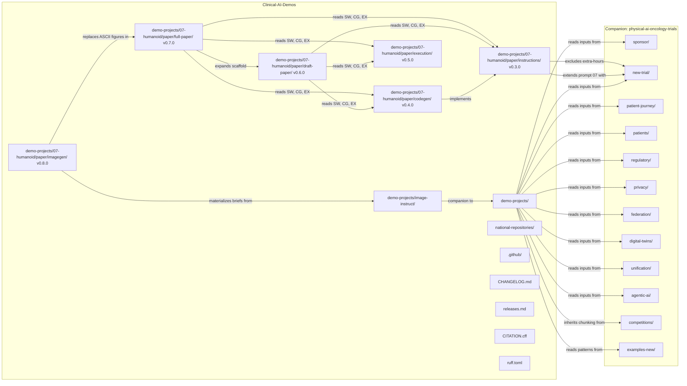
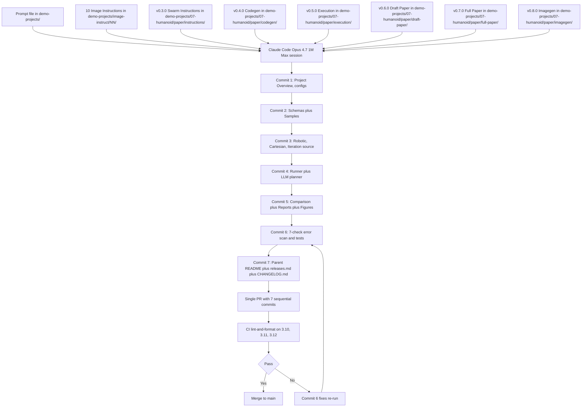

# Clinical-AI-Demos

[](https://opensource.org/licenses/MIT)
[](https://github.com/kevinkawchak/Clinical-AI-Demos)
[](https://github.com/kevinkawchak/Clinical-AI-Demos)
[](https://github.com/kevinkawchak/physical-ai-oncology-trials)
[](https://doi.org/10.5281/zenodo.18445179)
[](https://doi.org/10.5281/zenodo.18029100)
[](https://www.unitree.com)
[](https://www.nvidia.com)
[](https://www.python.org/)
[](releases.md)

**Demonstrations regarding humanoid agents and large language models for Physical AI oncology clinical trials, by Claude Code Opus 4.7; with assistance from kevinkawchak/physical-ai-oncology-trials.**

This repository delivers self-contained task brief prompts that downstream Claude Code Opus 4.7 1M Max sessions execute to author Physical AI oncology clinical trial demonstrations. Every demo centers on humanoid agents performing surgical and patient care tasks inside clinical trial sites.

**5/19: [PDF](https://doi.org/10.5281/zenodo.20303281) v0.8.0 (Adverse Event Imagegen Tree for the Triple Humanoid 4 Site Paper)** *Imagegen tree at `demo-projects/07-humanoid/paper/imagegen/` with 17 matplotlib scripts and 17 publication quality 300 dpi PNGs for the paper "Triple Humanoid 24/7 Adverse Event Oncology Trial Response Team.* [](https://github.com/kevinkawchak/Clinical-AI-Demos/tree/main/demo-projects/07-humanoid/paper/imagegen)

**5/20: v0.7.0 (Full Paper LaTeX Expansion for the Triple Humanoid 4 Site Paper)** *Full paper expansion at `demo-projects/07-humanoid/paper/full-paper/` for the paper "Triple Humanoid 24/7 Adverse Event Oncology Trial Response Team: 4-Site Rotation" by Kevin Kawchak (ORCID 0009-0007-5457-8667).* [](https://github.com/kevinkawchak/Clinical-AI-Demos/tree/main/demo-projects/07-humanoid/paper/full-paper)

**5/20: v0.6.0 (Draft Paper LaTeX Scaffold with Bracketed Instructions for the 70 Plus Page Triple Humanoid 4 Site Paper)** *Draft paper scaffold at `demo-projects/07-humanoid/paper/draft-paper/` for the upcoming paper "Triple Humanoid 24/7 Adverse Event Oncology Trial Response Team: 4-Site Rotation" * [](https://github.com/kevinkawchak/Clinical-AI-Demos/tree/main/demo-projects/07-humanoid/paper/draft-paper)

**5/18: v0.5.0 (3-Robot Camarade Swarm Codegen Execution Outcomes for Demo Prompt 07)** *Runtime counterpart to the v0.4.0 codegen tree. The execution tree at `demo-projects/07-humanoid/paper/execution/` captures the runtime outcomes of every executable element in the codegen tree.* [](https://github.com/kevinkawchak/Clinical-AI-Demos/tree/main/demo-projects/07-humanoid/paper/execution)

**5/17: v0.4.0 (3-Robot Unitree H2 EDU Camarade Swarm Codegen for Demo Prompt 07)** *Executable counterpart to the v0.3.0 instructions tree. The codegen at `demo-projects/07-humanoid/paper/codegen/` implements the 168-hour 4-site simulation in Python, C++, and Rust.* [](https://github.com/kevinkawchak/Clinical-AI-Demos/tree/main/demo-projects/07-humanoid/paper/codegen)

**5/17: v0.3.0 (3-Robot Camarade Swarm Instructions for Demo Prompt 07)** *Detailed code generation instructions for the 24/7 adverse event response demo, emphasizing 3 H2 humanoids per site as a swarm, broadcast publish-subscribe, peer 60 GHz UWB plus IR beacon physical communication.* [](https://github.com/kevinkawchak/Clinical-AI-Demos/tree/main/demo-projects/07-humanoid/paper/instructions)

**5/17: v0.2.0 (100 Image Instructions for the 10 Demo Prompts)** *Ten image instructions per prompt distributed 3 landscape full-page plus 7 portrait (value proposition canvas, financial waterfall, capability radar, sankey flow, process funnel, strategic quadrant, decision tree).* [](https://github.com/kevinkawchak/Clinical-AI-Demos/tree/main/demo-projects/image-instruct)

**5/16: v0.1.0 (Humanoid + LLM Oncology Trial Demo Prompts)** *Ten standalone prompts spanning trial site operations, sponsor center, pharmacy compounding, recovery nursing, pathology lab, tele-surgery, AE response, research coordinator, radiation oncology, decentralized home care.* [](https://github.com/kevinkawchak/Clinical-AI-Demos/tree/main/demo-projects)

> **v0.8.0** - Eighth release. The imagegen tree for Demo 07 lives at `demo-projects/07-humanoid/paper/imagegen/`. 17 matplotlib scripts and 17 publication quality 300 dpi PNGs: 10 image-instruct renders at `imagegen/instructions/` that materialize the 10 image briefs at `demo-projects/image-instruct/07-adverse-event-response/`.
>
> **v0.7.0** - Seventh release. The full paper LaTeX expansion for Demo 07 lives at `demo-projects/07-humanoid/paper/full-paper/`. 12 source files plus a `LaTeX-Source.zip` Overleaf bundle. The 8 section files (abstract, introduction, methods, results, discussion, limitations_future, conclusions.
>
> **v0.6.0** - Sixth release. The draft paper LaTeX scaffold for Demo 07 lives at `demo-projects/07-humanoid/paper/draft-paper/`. 12 source files plus a `LaTeX-Source.zip` Overleaf bundle. Each section file (abstract, introduction, methods, results, discussion, limitations_future, conclusions, back_matter).
>
> **v0.5.0** - Fifth release. The runtime execution outcomes for the v0.4.0 codegen tree live at `demo-projects/07-humanoid/paper/execution/`. 50 file execution tree with 23 per-step logs (schema ingest, pytest 36 passed, module imports 22 of 22, per source file smoke tests, 4-site site_runtime, week_runner fast mode, h2_dispatcher 12-robot roster, .
>
> **v0.4.0** - Fourth release. The executable codegen for Demo 07 lives at `demo-projects/07-humanoid/paper/codegen/`. Runs on MacOS, Windows, Linux, or under Claude Code Opus 4.7 1M Max. Robot platform: Unitree H2 EDU with dexterous hands (6 fingers per hand, 12 grasp poses, 0.05 N tactile resolution).
>
> **v0.3.0** - Third release. Demo 07 (Humanoid 24/7 Adverse Event Response) extended with multi-robot synergy. The new code generation instructions in `demo-projects/07-humanoid/paper/instructions/` define swarm behavior between 3 robots per site, physical communication via 60 GHz UWB and IR beacon, and intellectual communication.
>
> **v0.2.0** - Second release. 100 image instructions for the 10 prompts (10 per prompt: 3 landscape full-page plus 7 portrait), shared color palette and DejaVu Sans typography, matplotlib-only Python script conventions, single-dashes-only and section-sign rules, white background facecolor.
>
> **v0.1.0** - First release. 10 humanoid + LLM oncology trial demo prompts, complete repository scaffolding (CI workflow for Python 3.10/3.11/3.12, ruff and yamllint configuration, governance files), national-repositories meta-prompting guide carried forward from the initial commit history.

## Responsible Use

This repository is a complementary open-source resource, please implement code safely and responsibly. Intended audience: engineers, clinicians, and clinical trial operations teams building humanoid + LLM systems (Atlas, Optimus, Figure, Digit, Phoenix, Apollo, Neo, H2 humanoids; Claude, GPT, Gemini, Ollama, GR00T LLMs) for oncology clinical trial deployments.

## Quick Start

```bash
# Clone the repository
git clone https://github.com/kevinkawchak/Clinical-AI-Demos.git
cd Clinical-AI-Demos

# Inspect the 10 demo prompts
ls demo-projects/

# Inspect the 100 image instructions (10 per prompt)
ls demo-projects/image-instruct/

# Inspect the v0.3.0 swarm instructions for prompt 07
ls demo-projects/07-humanoid/paper/instructions/

# Inspect the v0.4.0 executable codegen for prompt 07
ls demo-projects/07-humanoid/paper/codegen/

# Inspect the v0.5.0 execution outcomes for prompt 07
ls demo-projects/07-humanoid/paper/execution/

# Inspect the v0.6.0 draft paper scaffold for prompt 07
ls demo-projects/07-humanoid/paper/draft-paper/

# Inspect the v0.7.0 full paper expansion for prompt 07
ls demo-projects/07-humanoid/paper/full-paper/

# Inspect the v0.8.0 imagegen tree (17 matplotlib scripts and 300 dpi PNGs)
ls demo-projects/07-humanoid/paper/imagegen/

# Install lint tools to verify CI cleanliness
pip install ruff yamllint
ruff check .
ruff format --check .
yamllint -d relaxed .github/

# Read the meta-prompting guide
less national-repositories/build-national.md

# To execute a prompt, also clone the companion repository
git clone https://github.com/kevinkawchak/physical-ai-oncology-trials.git ../physical-ai-oncology-trials
```

## Humanoid Coverage (v0.1.0 through v0.7.0)

```
  Humanoid Platform               Per-Demo Mapping               LLM Backend
  +------------------------+      +-----------------------+      +------------+
  | Boston Dynamics        |  ->  | 01 Site Operations    |  ->  | Claude     |
  | Atlas Electric         |      | 09 Rad Onc (paired)   |      | Opus 4.7   |
  | 28 DOF, 1.5 m, 89 kg   |      |                       |      | 1M on-prem |
  +------------------------+      +-----------------------+      +------------+
  | Tesla Optimus Gen 3    |  ->  | 02 Sponsor Center 5x  |  ->  | Sonnet 4.6 |
  | 43 DOF, 1.73 m, 57 kg  |      | 09 Rad Onc (paired)   |      | + Opus     |
  +------------------------+      +-----------------------+      +------------+
  | Figure 03              |  ->  | 03 Pharmacy CAR-T     |  ->  | GPT-5.5    |
  | 32 DOF, 1.68 m, 60 kg  |      | 10 Home DCT (Field)   |      | Haiku 4.5  |
  +------------------------+      +-----------------------+      +------------+
  | Agility Digit V5       |  ->  | 04 Recovery Room PACU |  ->  | Claude     |
  | 16 DOF, 1.8 m, 80 kg   |      |                       |      | + Llama 4  |
  +------------------------+      +-----------------------+      +------------+
  | Sanctuary Phoenix Gen 8|  ->  | 05 Pathology Lab CAP  |  ->  | Gemini 3   |
  | 24 DOF/hand, 1.7 m     |      |                       |      |+ Qwen 3    |
  +------------------------+      +-----------------------+      +------------+
  | Apptronik Apollo       |  ->  | 06 Tele-Surgical      |  ->  | Claude     |
  | 40 DOF, 1.73 m, 73 kg  |      | 1,100-mile rural site |      | + Operator |
  +------------------------+      +-----------------------+      +------------+
  | 1X Neo Beta            |  ->  | 08 Clinical Research  |  ->  | Multi-     |
  | 28 DOF, 1.65 m, 35 kg  |      | Coordinator, 5 langs  |      | Model      |
  +------------------------+      +-----------------------+      +------------+
  | Unitree H2 EDU (3 per  |  ->  | 07 4-Site AE Response |  ->  | Per-site   |
  | site, 39 DOF, 1.8 m,   |      | 12 H2 EDU in v0.4.0   |      | Claude     |
  | 70 kg, dexterous hands |      | codegen tree at       |      | Opus 4.7 1M|
  | plus Jetson AGX Thor   |      | demo-projects/07/.../ |      | broadcast  |
  | 2070 TOPS upgrade)     |      | paper/codegen/        |      | per tick   |
  +------------------------+      +-----------------------+      +------------+
```

## Repository Structure

```
Clinical-AI-Demos/
  README.md                                    # This file
  CHANGELOG.md                                 # Keep a Changelog format
  releases.md                                  # Release notes archive
  LICENSE                                      # MIT License
  CITATION.cff                                 # Citation metadata
  CONTRIBUTING.md                              # Contribution guide
  CODE_OF_CONDUCT.md                           # Contributor Covenant v2.1
  SECURITY.md                                  # Security policy
  SUPPORT.md                                   # Support and humanoid vendor links
  ruff.toml                                    # Ruff linter and formatter config
  .gitignore

  .github/
    workflows/
      ci.yml                                   # CI lint-and-format on 3.10, 3.11, 3.12
    ISSUE_TEMPLATE/
      bug_report.md
      feature_request.md
    PULL_REQUEST_TEMPLATE.md                   # Safety plus CI checklist

  demo-projects/                               # v0.1.0 Prompts + v0.2.0 Images + v0.3.0/v0.4.0/v0.5.0/v0.6.0/v0.7.0/v0.8.0 Swarm
    README.md                                  # Directory README with coverage matrix
    01-humanoid-site-operations-director.md    # Atlas Electric plus Claude Opus 4.7
    02-sponsor-humanoid-operations-center.md
    03-humanoid-pharmacy-imp-compounding.md
    04-humanoid-post-op-recovery-nurse.md
    05-humanoid-biospecimen-pathology-lab.md
    06-humanoid-tele-surgical-assistant.md
    07-humanoid-24-7-adverse-event-response.md
    07-humanoid/                               # v0.3.0 + v0.4.0 + v0.5.0 + v0.6.0 + v0.7.0 + v0.8.0 paper
      paper/
        instructions/                          # v0.3.0 code generation instructions
          README.md
          00-project-overview/
          01-commit-roadmap/
          02-config-instructions/
          03-schemas-instructions/
          04-robotic-instructions/
          05-cartesian-instructions/
          06-iteration-instructions/
          07-llm-planner-instructions/
          08-comparison-instructions/
          09-runtime-instructions/
          10-repository-update-instructions/
        codegen/                               # v0.4.0 executable codegen
          README.md                            # 11 badges, Unitree H2 EDU plus Jetson AGX Thor
          architecture.md                      # 6 layer architecture with Mermaid
          pyproject.toml                       # Python 3.10/3.11/3.12 with ruff cascade
          Cargo.toml                           # Rust runner crate
          docker-compose.yml                   # 4 per-site LLM, ingest, simulator, db, bus
          config/                              # 7 YAML config files
          schemas/                             # 11 JSON Schema files
          src/                                 # 24 Python plus 1 C++ plus 2 Rust source files
          data/                                # samples, sensor csv, xyz csv, CTCAE, baseline
          diagrams/                            # 3 ASCII diagrams capped at 80 by 60
          notebooks/                           # run_log.ipynb
          reports/                             # comparison_methodology, comparison.json, report.md
          figures/                             # 6 PNG figures at 300 dpi
          tests/                               # 6 pytest modules (36 tests)
          docker/                              # 4 Dockerfiles (llm, ingest, simulator, bus)
        execution/                             # v0.5.0 codegen run outputs
          README.md                            # 12 badges, 7 commit roadmap, ASCII flow
          logs/                                # 23 per step execution logs
          data/                                # iterations index original plus runtime plus runs
          diagrams/                            # 4 ASCII execution diagrams
          figures/                             # 6 PNG figures at 300 dpi (regenerated)
          reports/                             # 4 codegen report copies plus execution report
          outputs/                             # comparison plus iteration plus tree plus inventory
        draft-paper/                           # v0.6.0 draft paper LaTeX scaffold
          main.tex                             # Top level manuscript file
          humanoid_paper_template.sty          # Style file with shared 8 col table macro
          references.bib                       # 15 entries with clickable DOI plus URL
          README.md                            # 8 badges, file inventory, pipeline diagram
          LaTeX-Source.zip                     # Overleaf bundle of all source files
          sections/                            # 8 section files with bracketed instructions
            abstract.tex                       # ~300 word abstract scaffold
            introduction.tex                   # 5 subsection introduction scaffold
            methods.tex                        # 9 subsection methods scaffold
            results.tex                        # 7 subsection results scaffold
            discussion.tex                     # 6 subsection discussion scaffold
            limitations_future.tex             # 5 subsection limits and future scaffold
            conclusions.tex                    # 4 subsection conclusions scaffold
            back_matter.tex                    # Acks, Ethics, Rights, Cite, Data
        full-paper/                            # v0.7.0 full paper LaTeX expansion
          main.tex                             # Top level manuscript file (nocite for 3 anchors)
          humanoid_paper_template.sty          # Style with 8 col, narrative, metrics macros
          references.bib                       # 28 entries with clickable DOI plus URL
          README.md                            # 11 badges, headline metrics, ASCII diagrams
          LaTeX-Source.zip                     # Overleaf bundle of all source files
          sections/                            # 8 section files with finished prose
            abstract.tex                       # ~300 word abstract, no citations
            introduction.tex                   # 5 subsection introduction
            methods.tex                        # 9 subsection methods plus 4 tables, 4 figures
            results.tex                        # 7 subsection results plus 7 tables, 1 figure
            discussion.tex                     # 6 subsection discussion plus thesis anchor table
            limitations_future.tex             # 5 subsection limits plus 7 row roadmap table
            conclusions.tex                    # 4 subsection conclusions plus evidence table
            back_matter.tex                    # Acks, Ethics, Rights, Cite, Data table
        imagegen/                              # v0.8.0 imagegen tree (17 scripts + 17 PNGs)
          README.md                            # 10 badges, output inventory, palette, pipeline
          instructions/                        # 10 image-instruct renders at 300 dpi
          figures/                             # 7 paper figure replacements at 300 dpi
        templates/                             # Reserved for future template files
    08-humanoid-clinical-research-coordinator.md
    09-humanoid-radiation-oncology-technologist.md
    10-humanoid-decentralized-home-care.md
    image-instruct/                            # v0.2.0 100 image instruction MD files

  national-repositories/                       # Meta-prompting guidance
    build-national.md                          # Building National Repositories at Scale
```

## Mermaid: Repository Topology



## Mermaid: Demo Prompt + Image + Swarm Instruction Execution Loop



## Core Technologies (May 2026)

### Humanoid Platforms

| Platform | Vendor | DOF | Height | Mass | Payload | Primary Use in v0.1.0 to v0.4.0 |
|----------|--------|-----|--------|------|---------|---------------------------------|
| Atlas Electric | Boston Dynamics | 28 | 1.5 m | 89 kg | 11 kg/arm | Site director, RadOnc patient handler |
| Optimus Gen 3 | Tesla | 43 | 1.73 m | 57 kg | 9 kg/arm | Sponsor ops, RadOnc machine operator |
| Figure 03 | Figure AI | 32 | 1.68 m | 60 kg | 4 kg/arm | Pharmacy CAR-T compounding, home DCT |
| Digit V5 | Agility Robotics | 16 | 1.8 m | 80 kg | 9 kg/arm | Post-op recovery nurse |
| Phoenix Gen 8 | Sanctuary AI | 24/hand | 1.7 m | 70 kg | 5 kg/arm | CAP pathology lab |
| Apollo | Apptronik | 40 | 1.73 m | 73 kg | 25 kg/arm | Rural tele-surgical assistant |
| Neo Beta | 1X Technologies | 28 | 1.65 m | 35 kg | 5 kg/arm | Clinical research coordinator |
| H2 EDU (3 per site x 4 sites in v0.4.0) | Unitree Robotics | 39 | 1.8 m | 70 kg | 10 kg/arm | 24/7 AE response camarade swarm with Jetson AGX Thor 2070 TOPS compute upgrade and dexterous hands (6 fingers, 0.05 N tactile resolution) |

### LLM Backends

| Model | Vendor | Deployment | Latency Budget | Primary Use in v0.1.0 to v0.4.0 |
|-------|--------|------------|----------------|---------------------------------|
| Claude Opus 4.7 1M | Anthropic | On-prem plus cloud failover | 200 ms median | Site dir, sponsor failover, tele-surg, AE swarm broadcaster, RadOnc arbiter |
| Claude Sonnet 4.6 | Anthropic | On-prem | 100 ms | Sponsor center, recovery escalation |
| Claude Haiku 4.5 | Anthropic | On-prem plus edge | 50 ms | Recovery default, home DCT edge, H2 EDU Jetson Thor sidecar |
| GPT-5.5 Thinking | OpenAI | On-prem (Ollama-style) | 100 ms | Pharmacy compounding planner |
| Gemini 3 Pro | Google DeepMind | Cloud (Safe Harbor gated) | 150 ms | Pathology MCP, CRC multi-lang |
| Ollama Llama 4 70B | Meta plus Ollama | On-prem | 50 ms | Recovery PHI inference |
| Ollama Qwen3 72B | Alibaba plus Ollama | On-prem | 50 ms | Pathology MCP PHI inference |
| NVIDIA GR00T N1.6 | NVIDIA | DGX SuperPOD on-prem | 100 ms | RadOnc humanoid foundation model |
| NVIDIA Cosmos Reason 2 | NVIDIA | DGX SuperPOD on-prem | 100 ms | RadOnc vision-language |

## Documentation Files

| File | Purpose |
|------|---------|
| [README.md](README.md) | This top-level overview |
| [CHANGELOG.md](CHANGELOG.md) | Keep a Changelog format release log |
| [releases.md](releases.md) | Detailed release notes |
| [CITATION.cff](CITATION.cff) | Citation metadata for academic reference |
| [CONTRIBUTING.md](CONTRIBUTING.md) | Contribution guide with prompt authoring style |
| [CODE_OF_CONDUCT.md](CODE_OF_CONDUCT.md) | Contributor Covenant v2.1 |
| [SECURITY.md](SECURITY.md) | Security policy and humanoid safety considerations |
| [SUPPORT.md](SUPPORT.md) | Support channels and humanoid vendor links |
| [demo-projects/README.md](demo-projects/README.md) | Demo prompt directory README with coverage matrices |
| [demo-projects/image-instruct/README.md](demo-projects/image-instruct/README.md) | Image instruction directory README (v0.2.0 100 instructions, 10 per prompt) |
| [demo-projects/07-humanoid/paper/instructions/README.md](demo-projects/07-humanoid/paper/instructions/README.md) | Demo 07 v0.3.0 swarm instructions README (3-robot camarade pattern) |
| [demo-projects/07-humanoid/paper/codegen/README.md](demo-projects/07-humanoid/paper/codegen/README.md) | Demo 07 v0.4.0 executable codegen README (Unitree H2 EDU plus Jetson AGX Thor 2070 TOPS) |
| [demo-projects/07-humanoid/paper/execution/README.md](demo-projects/07-humanoid/paper/execution/README.md) | Demo 07 v0.5.0 codegen execution outcomes README (50 file execution tree with 23 logs, 4 ASCII diagrams, 6 figures, 4 outputs, 5 reports, 8 data artifacts) |
| [demo-projects/07-humanoid/paper/draft-paper/README.md](demo-projects/07-humanoid/paper/draft-paper/README.md) | Demo 07 v0.6.0 draft paper LaTeX scaffold README (8 badges, 12 source files, LaTeX-Source.zip, 70 plus page final paper target) |
| [demo-projects/07-humanoid/paper/full-paper/README.md](demo-projects/07-humanoid/paper/full-paper/README.md) | Demo 07 v0.7.0 full paper LaTeX expansion README (11 badges, 12 source files with finished prose, 28 reference entries, LaTeX-Source.zip) |
| [demo-projects/07-humanoid/paper/imagegen/README.md](demo-projects/07-humanoid/paper/imagegen/README.md) | Demo 07 v0.8.0 imagegen tree README (10 badges, 17 scripts and 17 PNGs at 300 dpi, palette, pipeline, reproduce-locally steps) |
| [national-repositories/build-national.md](national-repositories/build-national.md) | Meta-prompting guide for building national repositories |

## Citation

If you use this repository in your research, please cite:

```
@software{kawchak2026clinicalaidemos,
  author = {Kawchak, Kevin},
  title = {Clinical-AI-Demos: Humanoid and LLM Demos for Physical AI Oncology Clinical Trials},
  version = {0.8.0},
  year = {2026},
  publisher = {GitHub},
  url = {https://github.com/kevinkawchak/Clinical-AI-Demos}
}
```

The v0.3.0 swarm instructions and v0.4.0 codegen for demo 07 are built on the author's prior work on LLM-driven adverse event reporting:

```
@misc{kawchak_2025_18029100,
  author       = {Kawchak, Kevin},
  title        = {Code Generation Competition: 16 Proprietary vs.
                   Open-Source LLMs and Iterative Learning Based on FDA
                   Adverse Event Reporting System
                  },
  month        = dec,
  year         = 2025,
  publisher    = {Zenodo},
  doi          = {10.5281/zenodo.18029100},
  url          = {https://doi.org/10.5281/zenodo.18029100},
}
```

See [CITATION.cff](CITATION.cff) for the full citation metadata.

## License

MIT License - See [LICENSE](LICENSE) for details.
