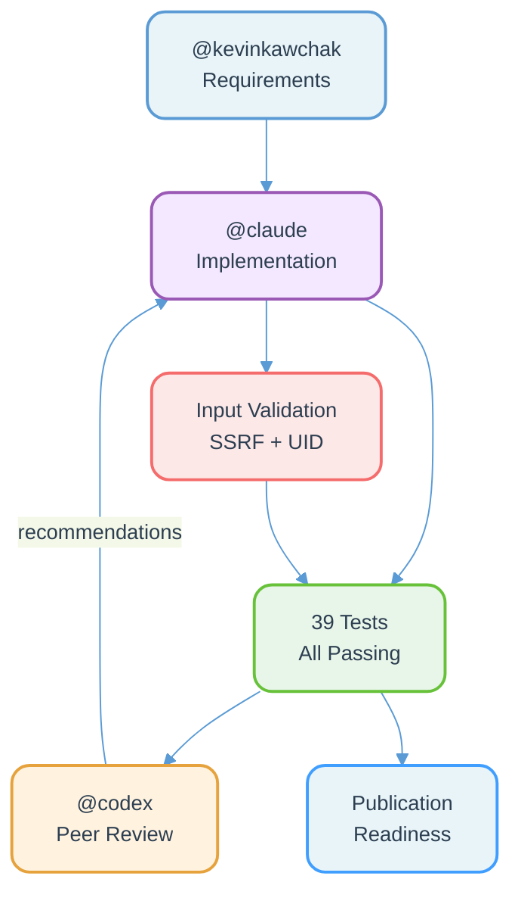
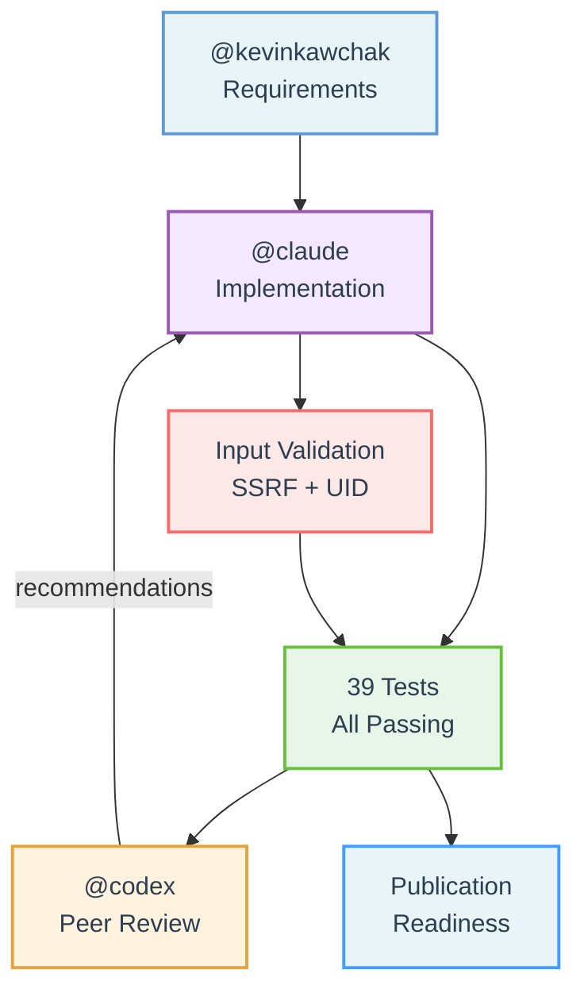
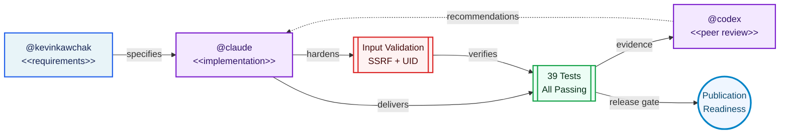
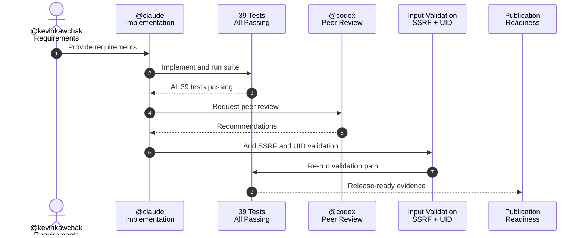
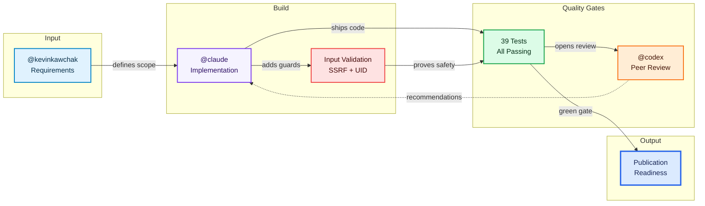
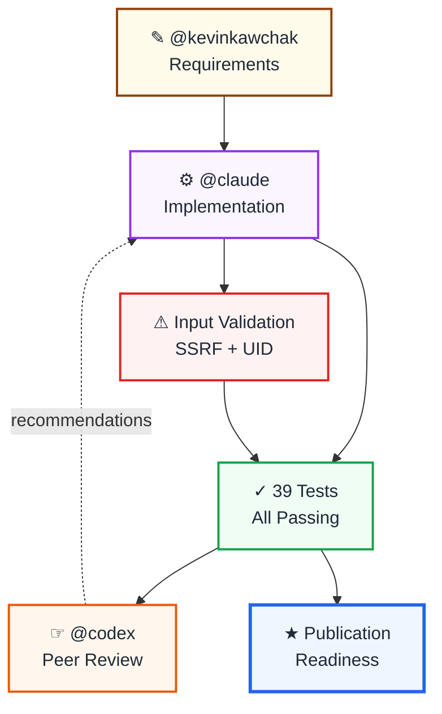
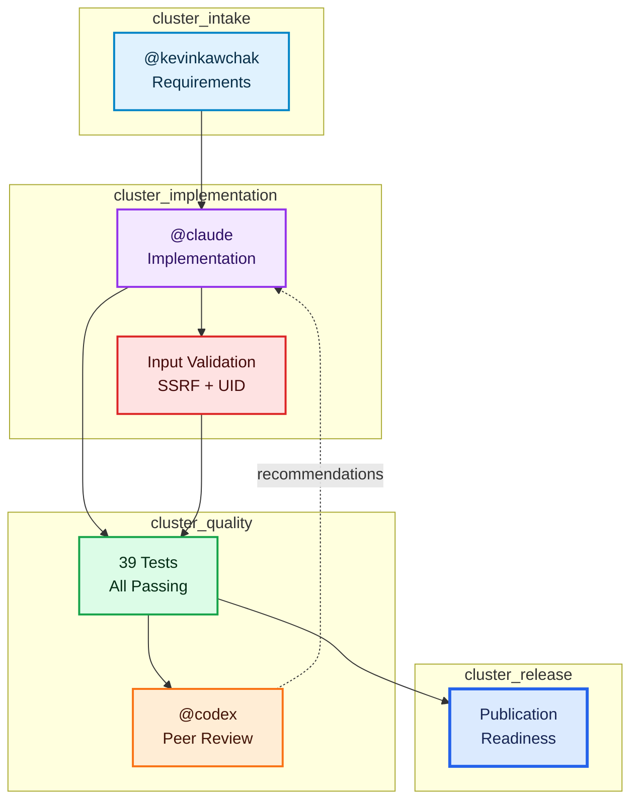
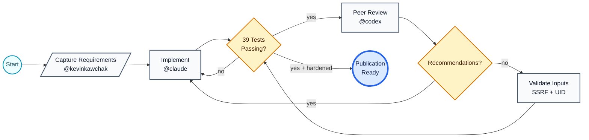
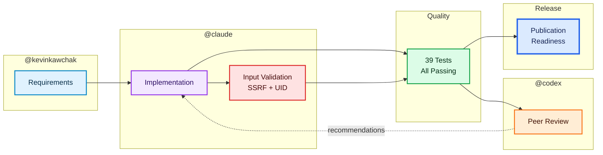
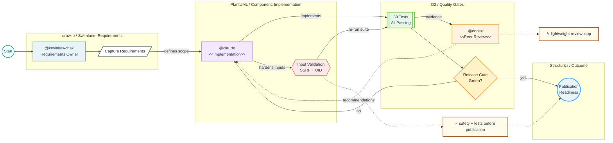

# Publication Readiness Workflow Diagrams

This README contains Mermaid diagrams for the `@kevinkawchak → @claude → @codex → tests → validation → publication` workflow.

All diagrams are written as plain Mermaid blocks intended to render directly in a GitHub `README.md`.

---

## Prompt

#### ChatGPT 5.5 Thinking Extended

Provide new mermaid diagram scripts for the attached script that is inspired by all other open source diagram software, such as 1) PlantUML, 2) D2, 3) Excalidraw. Produce additional scripts if they are based on open source software.




## 1. Original Workflow



---

## 2. PlantUML-Inspired Component Diagram



---

## 3. PlantUML-Inspired Sequence Diagram



---

## 4. D2-Inspired Declarative Map



---

## 5. Excalidraw-Inspired Sketch Board



---

## 6. Graphviz/DOT-Inspired Clustered Flow



---

## 7. Structurizr/C4-Inspired Architecture View

```mermaid
flowchart LR
    Person([Person<br/>@kevinkawchak<br/>Requirements Owner]):::person

    subgraph System["Software System: Publication Readiness Workflow"]
        Claude["Container<br/>@claude<br/>Implementation"]:::container
        Tests[("Component<br/>39 Tests<br/>All Passing")]:::component
        Validation{{"Component<br/>Input Validation<br/>SSRF + UID"}}:::security
        Release([Outcome<br/>Publication Readiness]):::outcome
    end

    Codex["External System<br/>@codex<br/>Peer Review"]:::external

    Person -->|provides requirements| Claude
    Claude -->|produces verified changes| Tests
    Tests -->|review evidence| Codex
    Codex -.->|recommendations| Claude
    Claude -->|adds hardening| Validation
    Validation -->|revalidates| Tests
    Tests -->|satisfies release gate| Release

    classDef person fill:#e0f2fe,stroke:#0369a1,stroke-width:2px,color:#082f49
    classDef container fill:#f5f3ff,stroke:#7c3aed,stroke-width:2px,color:#2e1065
    classDef component fill:#dcfce7,stroke:#16a34a,stroke-width:2px,color:#052e16
    classDef security fill:#fee2e2,stroke:#dc2626,stroke-width:2px,color:#450a0a
    classDef external fill:#ffedd5,stroke:#f97316,stroke-width:2px,color:#431407
    classDef outcome fill:#dbeafe,stroke:#2563eb,stroke-width:3px,color:#172554
```

---

## 8. BPMN-Style Workflow



---

## 9. draw.io-Inspired Swimlane Layout



---

## 10. Hybrid GitHub README Diagram


