# Output 01: Thirty Professional Mermaid Perspectives

[](https://github.com/kevinkawchak/Clinical-AI-Demos/tree/main/ai-outputs/output-01)
[](https://github.com/kevinkawchak/Clinical-AI-Demos/tree/main/ai-outputs/output-01)
[](https://github.com/kevinkawchak/Clinical-AI-Demos/tree/main/ai-outputs/output-01)
[](https://github.com/kevinkawchak/Clinical-AI-Demos/tree/main/ai-outputs/output-01)
[](https://github.com/kevinkawchak/Clinical-AI-Demos/tree/main/ai-outputs/output-01)
[](https://opensource.org/licenses/MIT)

This document presents 30 distinct Mermaid renderings of a single collaboration
workflow: the requirements, implementation, validation, testing, peer review, and
publication cycle that produces the artifacts in this repository. Every rendering
keeps the same six actors and seven relationships, yet each one offers its own
visual perspective so that a reader can pick the framing that best suits a slide,
a report, a board memo, or a legislative briefing.

The original prompt supplied one cartoon styled flowchart with heavily rounded
cards. The 30 perspectives below answer three goals at once. First, a professional
appearance through muted, print friendly color schemes drawn from the repository
palette. Second, crisp rectangular boxes with a small corner radius so the diagrams
read as formal exhibits rather than playful sketches. Third, fluent curved
connectors that bend gently along their whole length rather than snapping through a
single high curvature corner, achieved with smooth spline routing on every flowchart.

## Directory Structure

```
Clinical-AI-Demos/
  ai-outputs/
    output-01/
      README.md            # This file: 30 professional Mermaid perspectives
                           #   Section A: 3 ASCII diagram replacements
                           #   Section B: 3 PlantUML inspired perspectives
                           #   Section C: 3 D2 inspired perspectives
                           #   Section D: 3 Excalidraw inspired perspectives
                           #   Section E: 3 Miro inspired perspectives
                           #   Section F: 3 Draw.io inspired perspectives
                           #   Section G: 3 Lucidchart inspired perspectives
                           #   Section H: 9 experimental perspectives
```

## Table of Contents

1. [The Source Example](#the-source-example)
2. [Design Conventions](#design-conventions)
3. [The Canonical Workflow](#the-canonical-workflow)
4. [Section A: ASCII Diagram Replacements](#section-a-ascii-diagram-replacements)
   - [01. ASCII Coordination Bus Fan-Out](#01-ascii-coordination-bus-fan-out)
   - [02. ASCII Swimlane Handoffs](#02-ascii-swimlane-handoffs)
   - [03. ASCII Vertical Stage Funnel](#03-ascii-vertical-stage-funnel)
5. [Section B: PlantUML Inspirations](#section-b-plantuml-inspirations)
   - [04. PlantUML Sequence of Record](#04-plantuml-sequence-of-record)
   - [05. PlantUML Activity Swimflow](#05-plantuml-activity-swimflow)
   - [06. PlantUML Component Assembly](#06-plantuml-component-assembly)
6. [Section C: D2 Inspirations](#section-c-d2-inspirations)
   - [07. D2 Nested Containers](#07-d2-nested-containers)
   - [08. D2 Schema Tables](#08-d2-schema-tables)
   - [09. D2 Linear Pipeline](#09-d2-linear-pipeline)
7. [Section D: Excalidraw Inspirations](#section-d-excalidraw-inspirations)
   - [10. Excalidraw Whiteboard Flow](#10-excalidraw-whiteboard-flow)
   - [11. Excalidraw Idea Map](#11-excalidraw-idea-map)
   - [12. Excalidraw Annotated Canvas](#12-excalidraw-annotated-canvas)
8. [Section E: Miro Inspirations](#section-e-miro-inspirations)
   - [13. Miro Kanban Lanes](#13-miro-kanban-lanes)
   - [14. Miro Radial Hub](#14-miro-radial-hub)
   - [15. Miro Framed Clusters](#15-miro-framed-clusters)
9. [Section F: Draw.io Inspirations](#section-f-drawio-inspirations)
   - [16. Draw.io Classic Flowchart](#16-drawio-classic-flowchart)
   - [17. Draw.io Cross Functional Swimlane](#17-drawio-cross-functional-swimlane)
   - [18. Draw.io Deployment Network](#18-drawio-deployment-network)
10. [Section G: Lucidchart Inspirations](#section-g-lucidchart-inspirations)
    - [19. Lucidchart BPMN Pools](#19-lucidchart-bpmn-pools)
    - [20. Lucidchart Process Ribbon](#20-lucidchart-process-ribbon)
    - [21. Lucidchart Entity Relationship](#21-lucidchart-entity-relationship)
11. [Section H: Experimental Perspectives](#section-h-experimental-perspectives)
    - [22. Experimental Delivery Timeline](#22-experimental-delivery-timeline)
    - [23. Experimental Contributor Journey](#23-experimental-contributor-journey)
    - [24. Experimental Git Review Graph](#24-experimental-git-review-graph)
    - [25. Experimental Effort Impact Quadrant](#25-experimental-effort-impact-quadrant)
    - [26. Experimental Block Matrix](#26-experimental-block-matrix)
    - [27. Experimental Sankey Throughput](#27-experimental-sankey-throughput)
    - [28. Experimental C4 System Context](#28-experimental-c4-system-context)
    - [29. Experimental Composite State Machine](#29-experimental-composite-state-machine)
    - [30. Experimental High Complexity Map](#30-experimental-high-complexity-map)
12. [Professional Color Palette](#professional-color-palette)
13. [Notes](#notes)

## The Source Example

The perspectives below all derive from the single flowchart that was provided as the
starting point. It is reproduced here so a reader can compare the cartoon styled
original against the refined renderings. The original uses a 12 pixel corner radius
on every card, which reads as playful rather than formal.

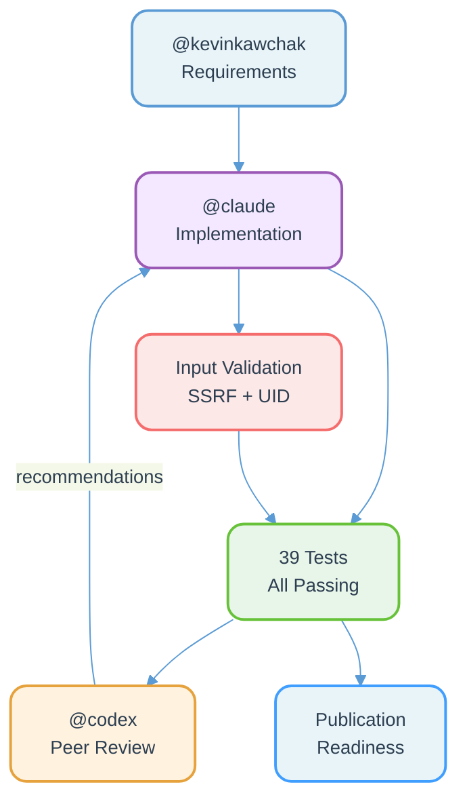

## Design Conventions

Every perspective in this document follows the same four rules so that the set reads
as one coherent, professional family rather than a grab bag of styles.

1. Professional color schemes. Fills are pale tints and strokes are the matching
   deep hue from the repository nine color palette (Deep Navy, Teal, Burgundy, Gold,
   Forest Green, Slate, Mauve, Light Gray, Off-White). Tool inspired sections shift
   the palette toward each tool signature while staying muted and print friendly.
   No neon, no saturated primaries, no gradients that distract from the content.

2. Less rounded boxes. Flowchart nodes set a small 2 to 4 pixel corner radius rather
   than the 12 pixel radius of the source. The result is a crisp rectangular exhibit
   suitable for a report annex or a legislative briefing, not a cartoon card.

3. Fluent curved connectors. Flowcharts set the edge curve to a smooth spline such as
   basis, natural, cardinal, catmullRom, monotoneX, monotoneY, bumpX, or bumpY. These
   bend gently across their full length and never collapse to a single high curvature
   corner. The step and linear routings, which produce sharp elbows, are deliberately
   avoided.

4. Built for complexity. Each perspective uses named node classes and container
   subgraphs so a future author can add stages, parallel branches, or new contributors
   without restyling the diagram. The structures scale from the six node baseline to
   far larger workflows.

A note on rendering. The experimental section uses several newer Mermaid diagram types
(timeline, journey, gitGraph, quadrantChart, block, sankey, C4, state composites). These
require a current Mermaid renderer. GitHub renders all of them. If you embed this file in
an older viewer, prefer the flowchart based perspectives, which are universally supported.

## The Canonical Workflow

All 30 perspectives preserve the same six actors and seven relationships.

| Node | Actor | Role |
|------|-------|------|
| Requirements | @kevinkawchak | Defines scope and acceptance criteria |
| Implementation | @claude | Authors the code and documentation |
| Input Validation | quality gate | SSRF and UID input checks |
| 39 Tests | quality gate | Full suite, all passing |
| Peer Review | @codex | Independent review and recommendations |
| Publication | release | Readiness for publication |

| Relationship | Meaning |
|--------------|---------|
| Requirements to Implementation | Scope handed to the author |
| Implementation to Input Validation | Author adds SSRF and UID guards |
| Implementation to 39 Tests | Author submits code to the suite |
| Input Validation to 39 Tests | Guards exercised by the suite |
| 39 Tests to Peer Review | Passing results handed to the reviewer |
| Peer Review to Implementation | Recommendations feed back to the author |
| 39 Tests to Publication | Passing suite gates the release |

## Section A: ASCII Diagram Replacements

These three perspectives replace three different ASCII diagram idioms that recur in
this repository: the coordination bus fan-out from the network layout files, the
time by actor swimlane from the adverse event response files, and the vertical stage
funnel from the iteration sweep files. Each keeps the structural intent of its ASCII
ancestor while delivering a clean, modern, professional rendering.

### 01. ASCII Coordination Bus Fan-Out

Replaces the boxed coordination bus that fans out to parallel workers. The
Implementation publishes onto an integration bus that fans to the two parallel quality
gates, which converge into review and publication. Navy and slate palette, basis spline.

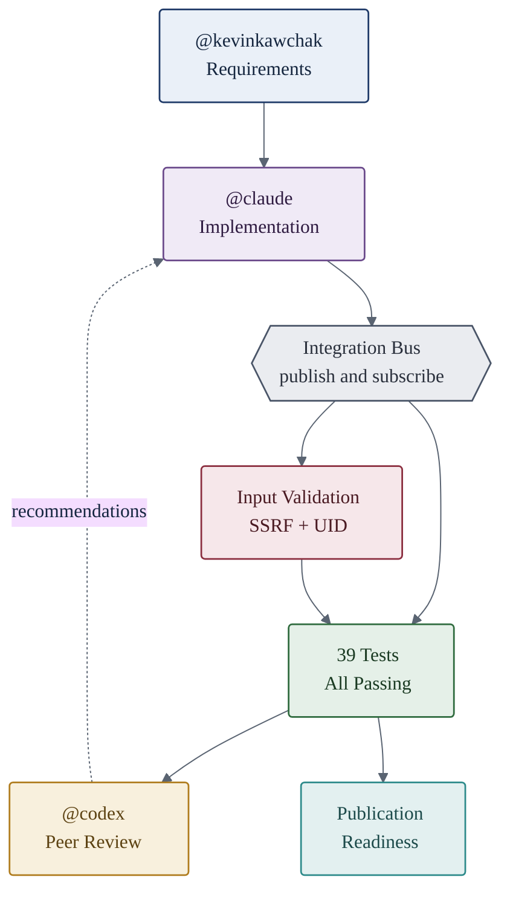

### 02. ASCII Swimlane Handoffs

Replaces the time by actor swimlane table. Each contributor owns a horizontal lane,
and the work flows left to right across lanes with a dashed recommendation handoff
returning to the author lane. Natural spline keeps the cross lane returns gentle.

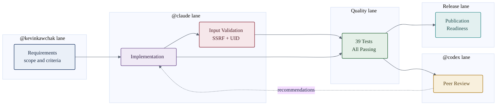

### 03. ASCII Vertical Stage Funnel

Replaces the vertical pipeline that stacks boxes connected by single shaft arrows. Stages
descend through a monotone vertical spline so the trunk never overshoots, with a dashed
recommendation return on the side. Slate forward trunk, muted accents per stage.

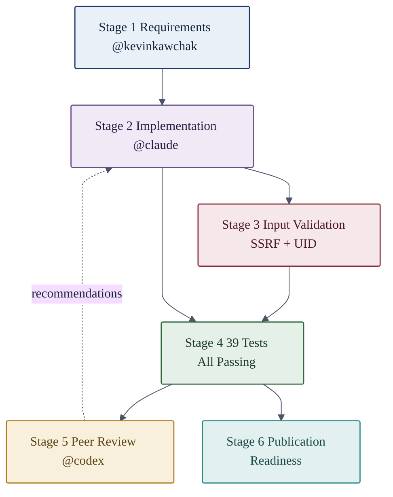

## Section B: PlantUML Inspirations

PlantUML is known for formal Unified Modeling Language renderings: sequence diagrams
with lifelines and activations, activity diagrams with start and stop markers and
choice nodes, and component diagrams with stereotype packages. These three perspectives
borrow that vocabulary while replacing the classic pale yellow fill with a refined
slate blue so the result reads as a corporate specification.

### 04. PlantUML Sequence of Record

A lifeline sequence with activations, an explicit review loop, and a closing note. This is
the most PlantUML native framing and is ideal for documenting the order of operations.

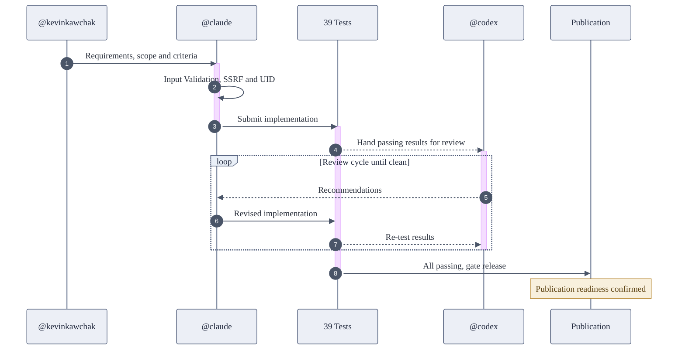

### 05. PlantUML Activity Swimflow

A state machine rendered as a PlantUML style activity diagram, with a start marker, a
choice node for the review verdict, and a stop marker. Composite friendly and formal.

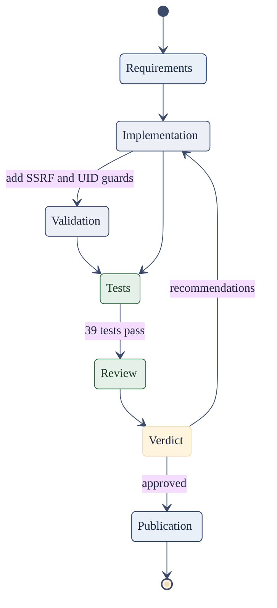

### 06. PlantUML Component Assembly

A component diagram with three stereotype packages (Authoring, Quality Gates, Release).
Subroutine shaped nodes evoke UML components. Cardinal spline, slate blue cards.

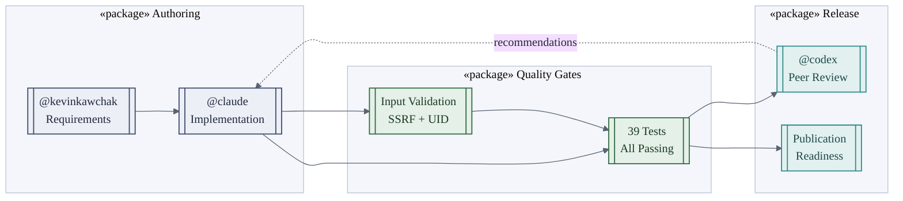

## Section C: D2 Inspirations

D2 from Terrastruct is known for clean modern layouts, deeply nested containers, a flat
cobalt palette, and SQL style tables. These three perspectives borrow the container
nesting, the flat cobalt fills, and the table shape, with smooth routing throughout.

### 07. D2 Nested Containers

D2 leans on containers within containers. Here the whole system is one outer container
holding three inner containers, with cross container edges. Flat cobalt, basis spline.

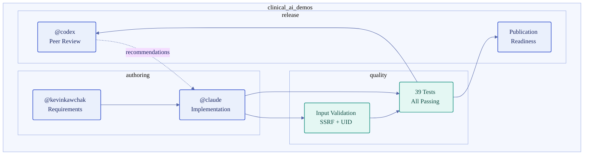

### 08. D2 Schema Tables

D2 renders entities as SQL style tables with typed fields. A class diagram captures that
shape exactly, with one class per stage, typed attributes, and a dashed recommendation
relationship back to the author. Cobalt theme.

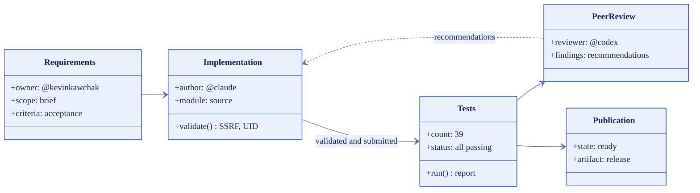

### 09. D2 Linear Pipeline

The clean left to right pipeline that D2 produces for a simple sequence, with a monotone
horizontal spline that never overshoots and a single dashed return arc. Flat and minimal.

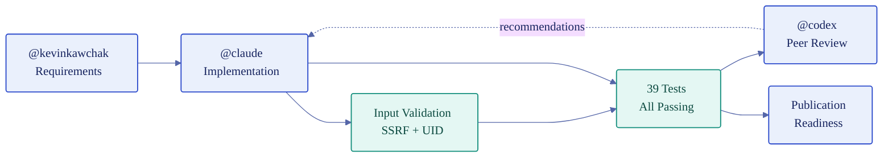

## Section D: Excalidraw Inspirations

Excalidraw is the freeform whiteboard. Its signature is a loose, annotated canvas with a
small distinctive palette of blue, green, orange, grape, and charcoal, plus dashed
connectors used as annotations. These three perspectives evoke the Excalidraw canvas and
its palette while keeping clean rendering, since the goal is professional rather than
hand drawn.

### 10. Excalidraw Whiteboard Flow

A whiteboard flow where the structural arrows are solid and the side commentary arrows are
dashed annotations, in the Excalidraw color family on near white fills. CatmullRom spline.

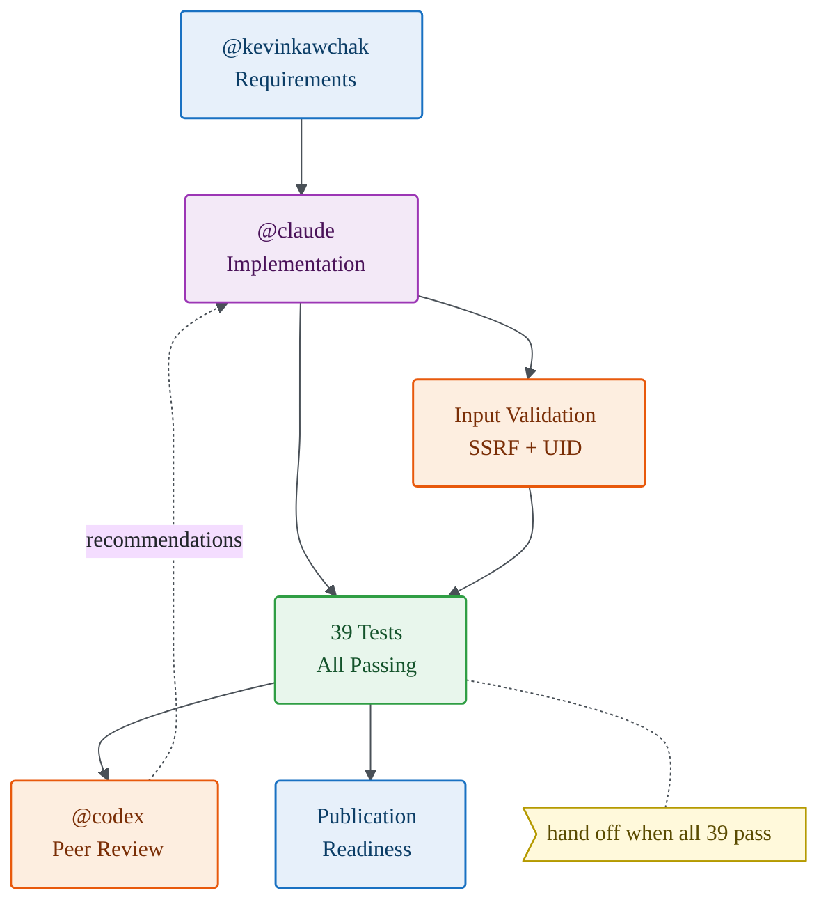

### 11. Excalidraw Idea Map

The loose idea map that an Excalidraw session often starts with, rendered as a Mermaid
mindmap so the branches radiate from a central concept. Excalidraw palette via theme.

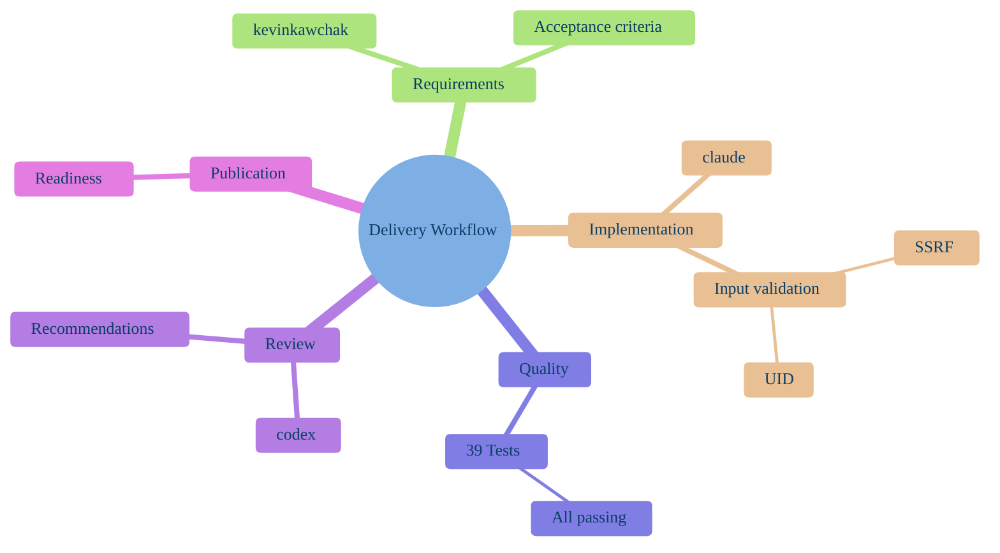

### 12. Excalidraw Annotated Canvas

A horizontal canvas where each structural node carries a small dashed annotation card, the
way a reviewer marks up an Excalidraw board. Natural spline, Excalidraw color family.

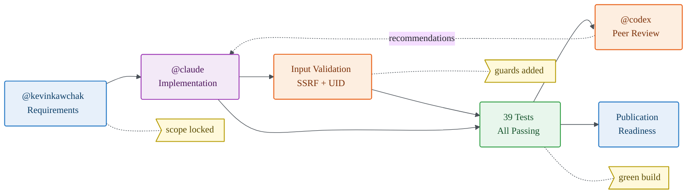

## Section E: Miro Inspirations

Miro is the collaborative infinite canvas: sticky note grids, kanban columns, radial mind
maps, and labeled frames. These three perspectives borrow those layouts with a muted
sticky note palette and dark text so the boards remain boardroom appropriate.

### 13. Miro Kanban Lanes

A kanban board with five column frames from Define to Ship. Work cards move left to right,
and a dashed recommendation card returns from Review to Build. Basis spline, sticky palette.

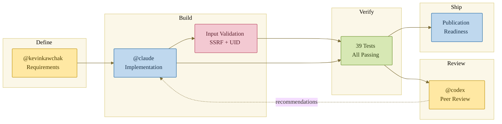

### 14. Miro Radial Hub

A radial hub map where the central workflow node connects to every stage with light
spokes, while the directed work edges curve between the stages. Cardinal spline, sticky hub.

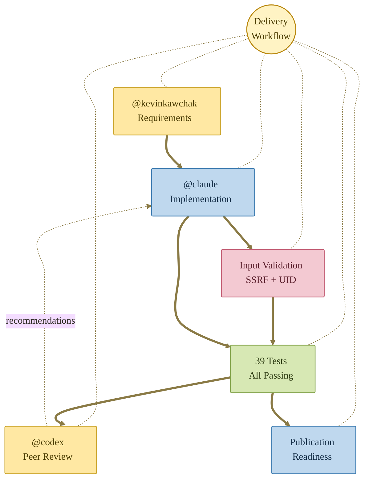

### 15. Miro Framed Clusters

Two labeled frames, Make and Ship, group the stages the way Miro frames organize a board.
Sticky cards inside, bumpY spline for soft vertical S curves between the frames.

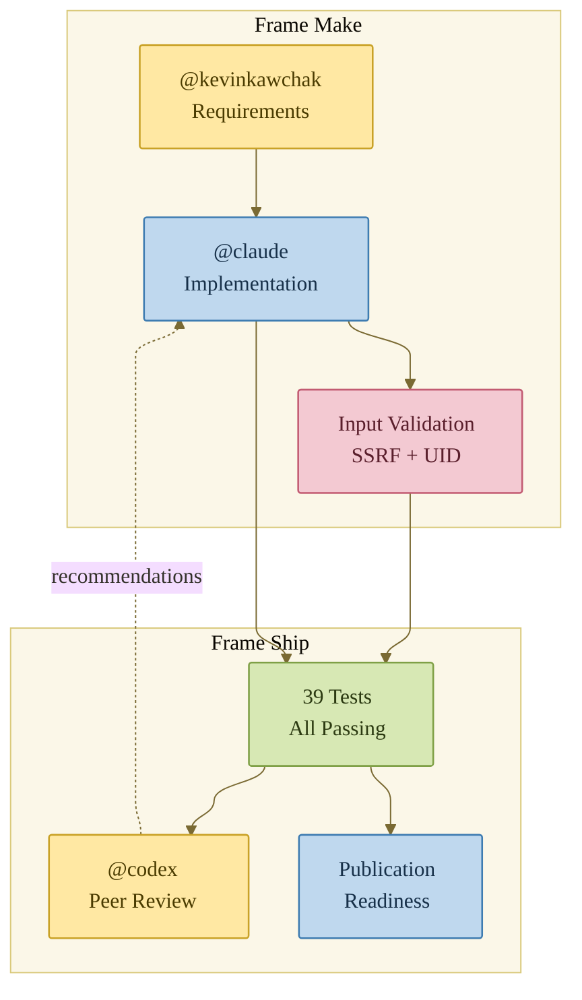

## Section F: Draw.io Inspirations

Draw.io, now diagrams.net, is the standard office flowchart tool. Its signature is the
pale blue process box with a darker blue stroke, the green terminator, the orange decision
diamond, and the cross functional swimlane. These three perspectives reproduce that
familiar corporate look that legislative and operations audiences recognize instantly.

### 16. Draw.io Classic Flowchart

The classic office flowchart with rounded terminators for start and stop, pale blue process
boxes, and an orange decision diamond for the review verdict. Basis spline, draw.io palette.

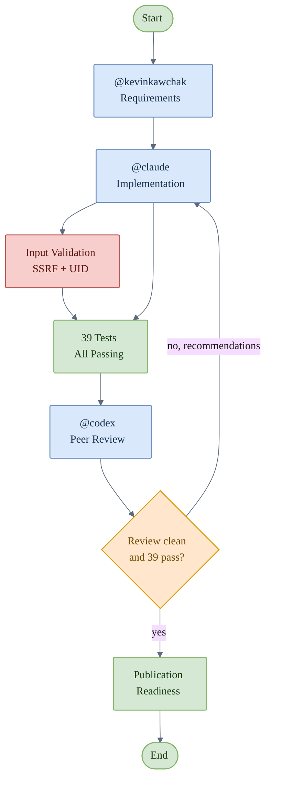

### 17. Draw.io Cross Functional Swimlane

The cross functional swimlane that draw.io uses for process ownership, with each
contributor as a horizontal pool. Natural spline keeps the cross pool transitions smooth.

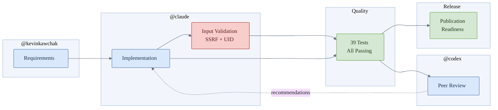

### 18. Draw.io Deployment Network

The deployment style network that draw.io produces for systems, with rectangular device
nodes and a labeled tier boundary. BumpX spline for soft horizontal S curves, classic palette.

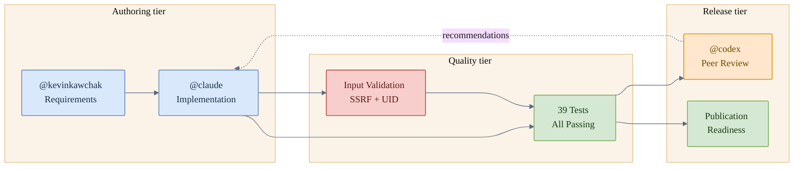

## Section G: Lucidchart Inspirations

Lucidchart is the polished business diagramming suite. Its signature is the indigo and
teal brand palette, Business Process Model and Notation pools and gateways, clean process
ribbons, and entity relationship models. These three perspectives carry that polished,
executive ready feel.

### 19. Lucidchart BPMN Pools

A Business Process Model and Notation layout with an author pool, a quality pool, and a
diamond gateway for the review decision. Indigo brand palette, basis spline.

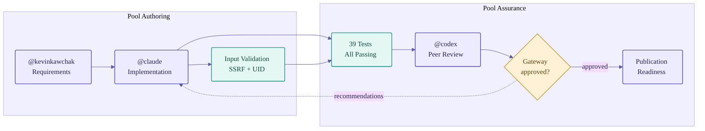

### 20. Lucidchart Process Ribbon

The clean left to right process ribbon Lucidchart produces for an executive summary, with
indigo stages, a teal quality midsection, and a monotone horizontal spline.

```mermaid
%%{init: {'theme':'base','themeVariables':{'fontFamily':'Segoe UI, Helvetica, Arial, sans-serif','lineColor':'#5A56B0','primaryTextColor':'#23215C'},'flowchart':{'curve':'monotoneX','nodeSpacing':30,'rankSpacing':56,'htmlLabels':true}}}%%
flowchart LR
  REQ["@kevinkawchak<br/>Requirements"]:::lc
  IMPL["@claude<br/>Implementation"]:::lc
  VALID["Input Validation<br/>SSRF + UID"]:::lcteal
  TEST["39 Tests<br/>All Passing"]:::lcteal
  REVIEW["@codex<br/>Peer Review"]:::lc
  PUB["Publication<br/>Readiness"]:::lcgold

  REQ --> IMPL --> VALID --> TEST --> REVIEW
  IMPL --> TEST
  TEST --> PUB
  REVIEW -.->|recommendations| IMPL

  classDef lc fill:#ECEBFF,stroke:#4A45C4,stroke-width:1.4px,color:#23215C,rx:3,ry:3
  classDef lcteal fill:#E4F7F3,stroke:#138E7C,stroke-width:1.4px,color:#0C4A40,rx:3,ry:3
  classDef lcgold fill:#FBF1D8,stroke:#B07D1F,stroke-width:1.4px,color:#5C4212,rx:3,ry:3
```

### 21. Lucidchart Entity Relationship

The entity relationship model Lucidchart uses for data and process traceability. Each stage
is an entity with typed attributes, and crow foot relationships capture cardinality, including
the optional recommendation loop back to Implementation.

```mermaid
%%{init: {'theme':'base','themeVariables':{'fontFamily':'Segoe UI, Helvetica, Arial, sans-serif','primaryColor':'#ECEBFF','primaryBorderColor':'#4A45C4','primaryTextColor':'#23215C','lineColor':'#5A56B0'}}}%%
erDiagram
  REQUIREMENT ||--|{ IMPLEMENTATION : "scopes"
  IMPLEMENTATION ||--|| VALIDATION : "guards"
  IMPLEMENTATION ||--|{ TEST : "exercised by"
  TEST ||--|| REVIEW : "summarized to"
  REVIEW ||--o{ IMPLEMENTATION : "recommends"
  TEST ||--|| PUBLICATION : "gates"
  REQUIREMENT {
    string owner "kevinkawchak"
    string scope "acceptance criteria"
  }
  IMPLEMENTATION {
    string author "claude"
    string module "source"
  }
  VALIDATION {
    string ssrf "blocked"
    string uid "checked"
  }
  TEST {
    int count "39"
    string status "all passing"
  }
  REVIEW {
    string reviewer "codex"
    string findings "recommendations"
  }
  PUBLICATION {
    string state "ready"
  }
```

## Section H: Experimental Perspectives

These nine perspectives are deliberately exploratory. They reach for Mermaid diagram types
that reframe the same workflow as a timeline, a satisfaction journey, a version control
graph, a prioritization quadrant, a dense block matrix, a flow throughput chart, a system
context, a composite state machine, and a high complexity map. Each one stays within the
professional palette and crisp box discipline, while showing how far a single workflow can
be reinterpreted for different audiences.

### 22. Experimental Delivery Timeline

A chronological timeline grouped by phase, useful for a milestone slide where the order of
events matters more than the branching.

```mermaid
%%{init: {'theme':'base','themeVariables':{'fontFamily':'Segoe UI, Helvetica, Arial, sans-serif','cScale0':'#1F3A68','cScale1':'#2E8B8B','cScale2':'#2F6B3E','cScaleLabel0':'#ffffff','cScaleLabel1':'#ffffff','cScaleLabel2':'#ffffff'}}}%%
timeline
  title Delivery Workflow Timeline
  section Define
    Requirements : kevinkawchak sets scope and criteria
  section Build
    Implementation : claude authors the code
    Input Validation : SSRF and UID guards added
  section Verify
    39 Tests : full suite all passing
    Peer Review : codex returns recommendations
  section Ship
    Publication : readiness confirmed
```

### 23. Experimental Contributor Journey

A user journey that scores each step and names the contributor responsible, useful for
showing where effort and friction concentrate across the cycle.

```mermaid
%%{init: {'theme':'base','themeVariables':{'fontFamily':'Segoe UI, Helvetica, Arial, sans-serif','primaryColor':'#EAF0F8','primaryBorderColor':'#1F3A68','primaryTextColor':'#15263F'}}}%%
journey
  title Contributor Journey to Publication
  section Define
    Capture requirements: 4: kevinkawchak
  section Build
    Implement modules: 4: claude
    Validate inputs SSRF and UID: 3: claude
  section Verify
    Run 39 tests: 5: claude
    Peer review: 3: codex
    Apply recommendations: 4: claude
  section Ship
    Publication readiness: 5: kevinkawchak, claude
```

### 24. Experimental Git Review Graph

A version control graph that models the review feedback loop as a branch and merge, the
most literal rendering of how recommendations fold back into the main line of work.

```mermaid
%%{init: {'theme':'base','themeVariables':{'fontFamily':'Segoe UI, Helvetica, Arial, sans-serif','git0':'#1F3A68','git1':'#2E8B8B','git2':'#8B2E3F','gitBranchLabel0':'#ffffff','gitBranchLabel1':'#ffffff','gitBranchLabel2':'#ffffff','commitLabelColor':'#15263F','commitLabelBackground':'#F2F5FA','tagLabelColor':'#ffffff','tagLabelBackground':'#C18A2C','tagLabelBorder':'#8A6320'}}}%%
gitGraph
  commit id: "requirements"
  commit id: "implementation"
  branch validation
  commit id: "ssrf-uid-guards"
  checkout main
  merge validation
  commit id: "39-tests-pass"
  branch review
  commit id: "codex-recommendations"
  checkout main
  merge review id: "apply-recs"
  commit id: "publication-ready" tag: "release"
```

### 25. Experimental Effort Impact Quadrant

A prioritization quadrant that plots each stage by effort and release impact, useful for a
planning conversation about where to invest.

```mermaid
%%{init: {'theme':'base','themeVariables':{'fontFamily':'Segoe UI, Helvetica, Arial, sans-serif','quadrant1Fill':'#E5F0E8','quadrant2Fill':'#EAF0F8','quadrant3Fill':'#F2F3F5','quadrant4Fill':'#FBF1D8','quadrant1TextFill':'#1A3A22','quadrant2TextFill':'#15263F','quadrant3TextFill':'#2A303C','quadrant4TextFill':'#5C4212','quadrantPointFill':'#1F3A68','quadrantPointTextFill':'#15263F','quadrantTitleFill':'#15263F','quadrantXAxisTextFill':'#2A303C','quadrantYAxisTextFill':'#2A303C','quadrantInternalBorderStrokeFill':'#9AA3B2','quadrantExternalBorderStrokeFill':'#5A6472'}}}%%
quadrantChart
  title Workflow Stages by Effort and Release Impact
  x-axis Low Effort --> High Effort
  y-axis Low Impact --> High Impact
  quadrant-1 Invest
  quadrant-2 Protect
  quadrant-3 Delegate
  quadrant-4 Maintain
  Requirements: [0.25, 0.70]
  Implementation: [0.80, 0.85]
  Input Validation: [0.45, 0.75]
  Tests: [0.55, 0.90]
  Peer Review: [0.40, 0.62]
  Publication: [0.30, 0.95]
```

### 26. Experimental Block Matrix

A dense block layout that packs the workflow into a compact grid, suited to an at a glance
status tile on a dashboard. Block diagrams scale well as a workflow grows wide.

```mermaid
%%{init: {'theme':'base','themeVariables':{'fontFamily':'Segoe UI, Helvetica, Arial, sans-serif','lineColor':'#5A6472','primaryTextColor':'#15263F'}}}%%
block-beta
  columns 5
  REQ["@kevinkawchak Requirements"]:1 space:1 IMPL["@claude Implementation"]:1 space:1 VALID["Validation SSRF UID"]:1
  space:5
  REVIEW["@codex Peer Review"]:1 space:1 TEST["39 Tests Passing"]:1 space:1 PUB["Publication Readiness"]:1
  REQ --> IMPL
  IMPL --> VALID
  IMPL --> TEST
  VALID --> TEST
  TEST --> REVIEW
  REVIEW --> IMPL
  TEST --> PUB
  classDef a fill:#EAF0F8,stroke:#1F3A68,color:#15263F
  classDef b fill:#E5F0E8,stroke:#2F6B3E,color:#1A3A22
  classDef c fill:#F6E7EA,stroke:#8B2E3F,color:#4A1A22
  class REQ,IMPL,PUB a
  class TEST b
  class VALID,REVIEW c
```

### 27. Experimental Sankey Throughput

A Sankey flow that shows how work volume splits across the validation and test paths and
converges on publication, with the recommendation loop drawn as a return flow.

```mermaid
sankey-beta

Requirements,Implementation,10
Implementation,Input Validation,4
Implementation,Tests,6
Input Validation,Tests,4
Tests,Peer Review,10
Peer Review,Implementation,3
Tests,Publication,7
```

### 28. Experimental C4 System Context

A C4 system context that frames the workflow as people and systems, the standard software
architecture lens for an executive or governance audience.

```mermaid
C4Context
  title System Context for the Delivery Workflow
  Person(kev, "@kevinkawchak", "Requirements owner")
  Person(cod, "@codex", "Peer reviewer")
  System(impl, "@claude Implementation", "Authors validated code")
  System(qa, "Quality Gate", "39 tests, SSRF and UID validation")
  System(pub, "Publication", "Release readiness")
  Rel(kev, impl, "Provides requirements")
  Rel(impl, qa, "Submits for checks")
  Rel(qa, cod, "Routes passing results")
  Rel(cod, impl, "Recommendations")
  Rel(qa, pub, "Gates release")
```

### 29. Experimental Composite State Machine

A composite state machine that nests the workflow into Authoring, Quality Gate, and Review
Loop super states, demonstrating how the model scales to nested complexity without clutter.

```mermaid
%%{init: {'theme':'base','themeVariables':{'fontFamily':'Segoe UI, Helvetica, Arial, sans-serif','lineColor':'#5A6472','primaryTextColor':'#15263F'}}}%%
stateDiagram-v2
  direction LR
  [*] --> Authoring
  state Authoring {
    [*] --> Requirements
    Requirements --> Implementation
    Implementation --> [*]
  }
  Authoring --> QualityGate
  state QualityGate {
    direction TB
    [*] --> Validation
    Validation --> Tests : SSRF and UID ok
    Tests --> [*] : 39 pass
  }
  QualityGate --> ReviewLoop
  state ReviewLoop {
    [*] --> PeerReview
    PeerReview --> Verdict
    state Verdict <<choice>>
    Verdict --> [*] : approved
  }
  ReviewLoop --> Authoring : recommendations
  ReviewLoop --> Publication : approved
  Publication --> [*]

  classDef superstate fill:#EAF0F8,stroke:#1F3A68,color:#15263F
  class Authoring,QualityGate,ReviewLoop superstate
```

### 30. Experimental High Complexity Map

The capstone perspective shows how the six node baseline extends to a richer pipeline with
continuous integration, a security scan, a merge gate, documentation, and a release tag,
all grouped into phase subgraphs. Basis spline keeps the many connectors fluent. For very
large graphs, set the layout to elk in the init block for orthogonal routing at scale.

```mermaid
%%{init: {'theme':'base','themeVariables':{'fontFamily':'Segoe UI, Helvetica, Arial, sans-serif','lineColor':'#5A6472','primaryTextColor':'#15263F','clusterBkg':'#F5F7FA','clusterBorder':'#C2CAD6'},'flowchart':{'curve':'basis','nodeSpacing':36,'rankSpacing':52,'htmlLabels':true}}}%%
flowchart LR
  subgraph PH1["Phase 1  Define"]
    direction TB
    REQ["@kevinkawchak<br/>Requirements"]:::req
  end
  subgraph PH2["Phase 2  Build"]
    direction TB
    IMPL["@claude<br/>Implementation"]:::impl
    VALID["Input Validation<br/>SSRF + UID"]:::val
    SEC["Security Scan<br/>dependency audit"]:::val
  end
  subgraph PH3["Phase 3  Verify"]
    direction TB
    TEST["39 Tests<br/>All Passing"]:::test
    CI["Continuous Integration<br/>3.10, 3.11, 3.12"]:::test
    REVIEW["@codex<br/>Peer Review"]:::rev
  end
  subgraph PH4["Phase 4  Ship"]
    direction TB
    MERGE{"Merge Gate<br/>approved?"}:::gate
    DOCS["Documentation<br/>changelog and notes"]:::pub
    PUB["Publication<br/>Readiness"]:::pub
    REL["Release Tag<br/>versioned"]:::pub
  end

  REQ --> IMPL
  IMPL --> VALID
  IMPL --> SEC
  IMPL --> TEST
  VALID --> TEST
  SEC --> TEST
  TEST --> CI
  CI --> REVIEW
  REVIEW --> MERGE
  MERGE -.->|recommendations| IMPL
  MERGE -->|approved| DOCS
  DOCS --> PUB
  PUB --> REL
  TEST --> PUB

  classDef req fill:#EAF0F8,stroke:#1F3A68,stroke-width:1.4px,color:#15263F,rx:3,ry:3
  classDef impl fill:#F0EAF6,stroke:#6B4A8B,stroke-width:1.4px,color:#2E1A40,rx:3,ry:3
  classDef val fill:#F6E7EA,stroke:#8B2E3F,stroke-width:1.4px,color:#4A1A22,rx:3,ry:3
  classDef test fill:#E5F0E8,stroke:#2F6B3E,stroke-width:1.4px,color:#1A3A22,rx:3,ry:3
  classDef rev fill:#F8F0DD,stroke:#B07D1F,stroke-width:1.4px,color:#5C4212,rx:3,ry:3
  classDef pub fill:#E3F0F0,stroke:#2E8B8B,stroke-width:1.4px,color:#1C4A4A,rx:3,ry:3
  classDef gate fill:#EAECF0,stroke:#4A5568,stroke-width:1.4px,color:#2A303C
```

## Professional Color Palette

The fills and strokes above are drawn from the repository nine color palette plus a small
set of tool signature accents. Every fill is a pale tint of its stroke so the diagrams stay
print friendly and legible against a white page.

| Role | Fill | Stroke | Text | Used in |
|------|------|--------|------|---------|
| Requirements, Navy | #EAF0F8 | #1F3A68 | #15263F | Sections A, H |
| Implementation, Mauve | #F0EAF6 | #6B4A8B | #2E1A40 | Sections A, H |
| Validation, Burgundy | #F6E7EA | #8B2E3F | #4A1A22 | Sections A, H |
| Tests, Forest Green | #E5F0E8 | #2F6B3E | #1A3A22 | Sections A, H |
| Review, Gold | #F8F0DD | #B07D1F | #5C4212 | Sections A, H |
| Publication, Teal | #E3F0F0 | #2E8B8B | #1C4A4A | Sections A, H |
| Bus and Gate, Slate | #EAECF0 | #4A5568 | #2A303C | Sections A, H |
| PlantUML slate blue | #ECEFF6 | #3B4A6B | #20283D | Section B |
| D2 cobalt | #EAF0FC | #2B4ACB | #16235E | Section C |
| D2 teal accent | #E4F7F3 | #138E7C | #0C4A40 | Sections C, G |
| Excalidraw blue | #E7F0FA | #1971C2 | #0B3D66 | Section D |
| Excalidraw green | #E8F6EC | #2F9E44 | #14532B | Section D |
| Excalidraw orange | #FDEEE0 | #E8590C | #7A2E06 | Section D |
| Excalidraw grape | #F3E9F7 | #9C36B5 | #4A1259 | Section D |
| Miro sticky yellow | #FFE8A3 | #C9A227 | #4A3B00 | Section E |
| Miro sticky green | #D7E8B4 | #7FA046 | #2C3A12 | Section E |
| Miro sticky blue | #BFD8EE | #3E7CB1 | #173049 | Section E |
| Miro sticky pink | #F3C9D2 | #C25B72 | #5A1F2C | Section E |
| Draw.io process blue | #DAE8FC | #6C8EBF | #173049 | Section F |
| Draw.io terminator green | #D5E8D4 | #82B366 | #1A3A12 | Section F |
| Draw.io decision orange | #FFE6CC | #D79B00 | #6A4A00 | Section F |
| Draw.io alert red | #F8CECC | #B85450 | #5A1A18 | Section F |
| Lucidchart indigo | #ECEBFF | #4A45C4 | #23215C | Section G |
| Lucidchart gold | #FBF1D8 | #B07D1F | #5C4212 | Section G |

## Notes

- All 30 perspectives render the same six actors and seven relationships defined in the
  canonical workflow table, so a reader can compare framings without losing the meaning.

- The three Section A perspectives replace three distinct ASCII idioms used elsewhere in the
  repository: the coordination bus fan-out, the time by actor swimlane, and the vertical
  stage funnel.

- Sections B through G each contribute three perspectives inspired by a named tool, for 18
  tool inspired perspectives across PlantUML, D2, Excalidraw, Miro, Draw.io, and Lucidchart.

- Section H contributes nine experimental perspectives across timeline, journey, gitGraph,
  quadrantChart, block, sankey, C4, composite state machine, and a high complexity map.

- Curve policy. Every flowchart sets the edge curve to a smooth spline (basis, natural,
  cardinal, catmullRom, monotoneX, monotoneY, bumpX, or bumpY). These bend gently across
  their full length and avoid the single high curvature corner produced by step or linear
  routings.

- Box policy. Flowchart nodes set a 2 to 4 pixel corner radius rather than the 12 pixel
  radius of the source example, so the boxes read as formal rectangles suitable for a
  legislative or operations briefing.

- Extensibility. Each perspective uses named node classes and container subgraphs so a
  future author can add stages, parallel branches, or contributors without restyling. The
  high complexity map in perspective 30 demonstrates the baseline extended with continuous
  integration, a security scan, a merge gate, documentation, and a release tag.

- Formatting. Single dashes only, black text on white backgrounds, no dark mode. The
  experimental diagram types require a current Mermaid renderer such as the one GitHub uses.
