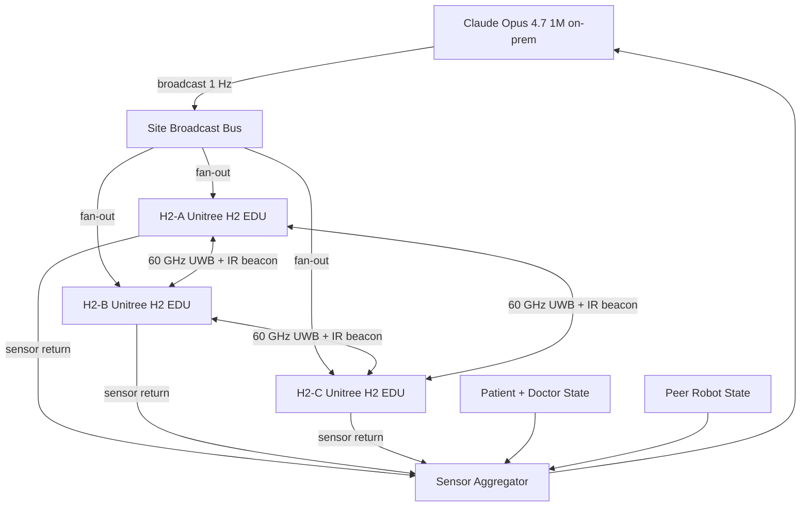
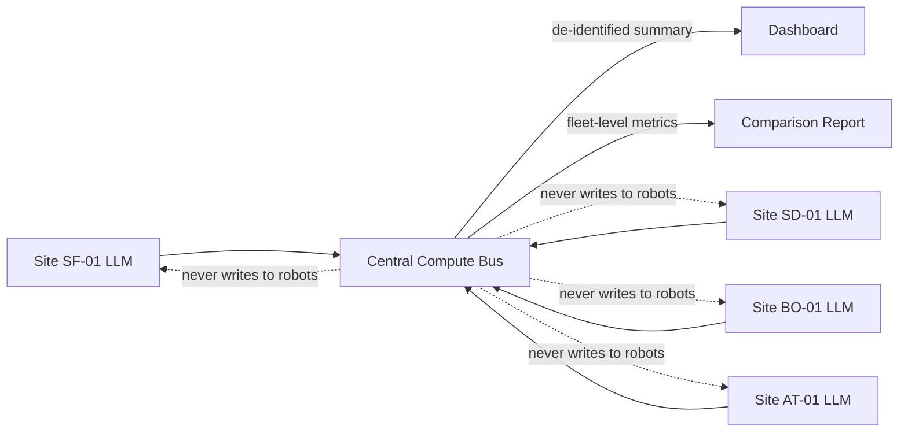

# Architecture: 3 Unitree H2 EDU Humanoids per Site, 4 Sites, 1 On-Prem LLM per Site

This document describes the v0.4.0 codegen implementation of the v0.3.0 instructions in `demo-projects/07-humanoid/paper/instructions/00-project-overview/architecture.md`.

## Layer 1: Site

There are 4 PAT-NET-001 sites: San Francisco (SF-01), San Diego (SD-01), Boston (BO-01), Atlanta (AT-01). Each site is fully self-sufficient for AE response:

- 3 dedicated Unitree H2 EDU humanoids parked at standby pods inside the site
- 1 dedicated Claude Opus 4.7 1M on-prem appliance with 200 ms median latency
- 1 dedicated broadcast bus that fans the per-tick command set to all 3 robots
- 1 dedicated sensor aggregator that joins per-robot sensor returns into a shared world model
- 1 dedicated AE intake feed from wearable devices, EHR, and patient self-report

No cross-site H2 EDU transit. The cross-site coordination bus carries only de-identified summaries for shared learning.

## Layer 2: Swarm at One Site

The 3 H2 EDU humanoids at one site form a swarm with a static identity per robot, a dynamic role at every tick (Lead, Assist, Reserve), a live peer-state model with 3 entries (self plus 2 peers), and a live patient-state model with up to 4 entries during an AE (the patient plus up to 3 doctors).

Roles rotate based on a priority score that combines proximity to the patient (0.40), battery state of charge (0.25), payload state (0.15), task affinity (0.10), and self-confidence (0.10).

## Layer 3: LLM Broadcaster

The per-site Claude Opus 4.7 1M instance produces one broadcast command per tick at 1 Hz. Each broadcast contains 3 named sub-commands (one for H2-A, one for H2-B, one for H2-C). The broadcast is published to the site bus in one atomic write. All 3 robots receive identical timestamps and acknowledge in the next tick.

The LLM has read access to the shared world model (patient state, peer-robot state, attending physician state) and write access to the broadcast topic only. The LLM never writes directly to a robot controller.

## Layer 4: Physical Communication

The 3 robots within a site talk to each other physically through:

- 60 GHz ultra-wideband peer mesh at 5 ms round-trip for hand-off requests, sensor sharing, and proximity alerts
- IR-band line-of-sight beacons at 1 ms round-trip for E-stop propagation and shared cartesian frame alignment

Physical communication is independent of the Claude Code server. If the on-prem LLM is unreachable, the robots maintain a degraded swarm using the last received broadcast and live peer messaging only.

## Layer 5: Intellectual Communication

The 3 robots within a site share intellectual context through the on-prem Claude Code server compute fabric. Each robot publishes its current task token, its sensor digest, and its self-reported confidence to the shared world model. The Claude Opus 4.7 1M instance integrates the 3 streams into a single tick decision and broadcasts the next command.

## Layer 6: Cross-Site Coordination Bus

The 4 sites talk to a central on-prem Claude Code compute bus that carries de-identified hourly summaries (AE counts by CTCAE grade, response time statistics, robot battery state, escalation counts), federated learning gradient updates (optional, post-hoc, batched per day), and zero PHI.

## Decision Cadence Summary

| Layer | Cadence | Latency Budget | Role |
|-------|---------|----------------|------|
| Sensor aggregator | 10 Hz | 5 ms | Build per-site world model |
| LLM broadcaster | 1 Hz | 200 ms | Author tick command for all 3 robots |
| Robot controller | 10 Hz | 5 ms | Drive joints from last broadcast |
| 60 GHz UWB peer mesh | 200 Hz | 5 ms round trip | Hand-off, sensor share, proximity |
| IR beacon | 1000 Hz | 1 ms round trip | E-stop and frame alignment |
| Cross-site summary | 1 per hour | 30 s | Fleet-level reporting |

## Failure Modes

- Site LLM down: robots degrade to last broadcast plus peer mesh. The Reserve becomes Lead if the original Lead loses LLM contact for more than 3 s.
- Single robot down: swarm contracts to 2 robots. Roles re-elect among the remaining 2 every tick.
- Two robots down: swarm contracts to 1 robot. That robot operates within a strict reduced-scope protocol that locks out shared force tasks and triggers physician escalation immediately.
- 60 GHz UWB mesh down: physical comms fall back to IR beacons only. Hand-off requests gate on a 100 ms confirmation rather than 5 ms.
- IR beacon down: E-stop falls back to the 60 GHz channel with a 10 ms ceiling.

## Mermaid Diagram: Per-Site Swarm

## Mermaid Diagram: Cross-Site Bus

## Companion Repository Inputs

The codegen tree reads these files from `kevinkawchak/physical-ai-oncology-trials` at run time (not committed here):

- `new-trial/national-24-7-trial/README.md`
- `new-trial/national-24-7-trial/FDA-April-2026/`
- `new-trial/national-24-7-trial/Background-A/`
- `new-trial/national-24-7-trial/Background-B/`
- `new-trial/national-24-7-trial/hour-00/` through `hour-55/` (verbatim)
- `patients/paper/full-paper/sections/hr_9505_realtime_sponsor.tex`
- `patients/paper/full-paper/sections/hr_9504_error_reduction.tex`
- `patient-journey/stage_09_surveillance.py`
- `agentic-ai/examples-agentic-ai/03_realtime_adaptive_treatment_agent.py`
- `agentic-ai/examples-agentic-ai/05_safety_constrained_agent_executor.py`
- `regulatory/ich-gcp/gcp_compliance_checker.py`
- `regulatory/fda-compliance/fda_submission_tracker.py`
- `regulatory-submit/audit_trail.py`
- `privacy/breach-response/breach_response_protocol.py`
- `unification/usl/humanoids/usl_humanoid_scoring.py`
- `competitions/instructions/chunking_strategy.md`
- `competitions/instructions/competition_protocol.md`

The `extra-hours/` dataset (hour-56 through hour-83) is NOT read in v0.4.0. Only hour-00 through hour-55.
