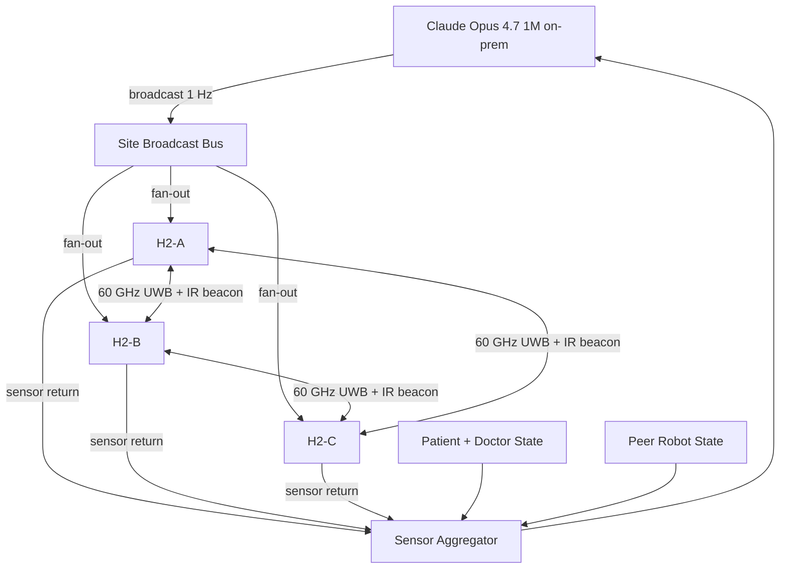

# Instructions: Humanoid 24/7 Adverse Event Response Swarm (Prompt 07 v0.3.0)

[](https://github.com/kevinkawchak/Clinical-AI-Demos)
[](https://github.com/kevinkawchak/Clinical-AI-Demos)
[](https://github.com/kevinkawchak/physical-ai-oncology-trials)
[](https://doi.org/10.5281/zenodo.18445179)
[](https://doi.org/10.5281/zenodo.18029100)
[](https://www.unitree.com)
[](https://www.anthropic.com)
[](https://www.python.org/)
[](https://opensource.org/licenses/MIT)

Released on 17 May 2026
CEO Kevin Kawchak, ChemicalQDevice

These instructions extend `demo-projects/07-humanoid-24-7-adverse-event-response.md` with multi-robot synergy semantics. A future Claude Code Opus 4.7 1M Max session reads this directory tree and generates code that runs on a high end conventional server under MacOS, Windows, or Linux.

## Thesis

On-premises repository based LLMs provide commands to humanoid robots based on real-time sensor data and controlled via x, y, z coordinates to administer synergistic treatment to patients adverse events. This workflow minimizes single robot error potential.

Three Unitree H2 humanoids per site act together as a swarm at all 4 PAT-NET-001 sites (San Francisco, San Diego, Boston, Atlanta). One Claude Opus 4.7 1M on-prem repository at each site broadcasts a single command set to all 3 robots per tick. The robots talk to one another physically (60 GHz ultra-wideband short range plus IR-band line-of-sight beacons) and intellectually (shared on-prem cloud compute fabric on the central Claude Code server). The robots adapt to patient acuity, attending physician presence, and the position and status of the other two robots in the swarm. This camaraderie reduces single robot error potential by a factor of 3.

## Synergy Modifications from the Base Prompt

1. Swarm behavior between robots. All 3 H2 humanoids per site act as a coordinated unit during every AE response. Roles are assigned at dispatch time and rebalanced live as the scene evolves.
2. Robots communicate physically and intellectually. Physical: 60 GHz ultra-wideband peer mesh plus IR beacon line-of-sight. Intellectual: shared on-prem Claude Code server compute fabric with broadcast publish-subscribe channels.
3. Shared cloud compute from a central on-premises Claude Code server. One per-site Claude Opus 4.7 1M instance feeds a single fan-out command stream to all 3 robots at 1 Hz.
4. One instruction set is sent simultaneously to all 3 robots per site per tick. Each robot interprets its role token from the same broadcast payload.
5. Robots adapt to patients, doctors, and other robots. The adapter accepts 3 inputs at every tick: patient state, attending physician state, and peer-robot state.

## Robot Camaraderie

The 3 H2 humanoids per site work as camarades. Each robot:

- Holds a live model of where the other two are standing, what they are doing, and what they will do next.
- Yields workspace to a peer whose role is higher priority on the active AE.
- Hands tools to a peer (epinephrine auto-injector, pulse oximeter, vagus nerve probe) within 2 seconds of a peer request.
- Steps in if a peer reports a fault, a low battery, or a stuck path.
- Treats peer-reported sensor readings as first-class evidence equal to its own sensors.

The robot camaraderie pattern is the single most important emergent property of the swarm. It is what reduces single robot error potential. Every config, every schema, every src file, every iteration, every figure must reflect it.

## Inventory at a Glance

| Property | Value |
|----------|-------|
| Network | PAT-NET-001 with 4 sites: San Francisco, San Diego, Boston, Atlanta |
| Robots per site | 3 Unitree H2 (39 DOF, 1.8 m, 70 kg, 10 kg payload per arm, 5 hour battery hot-swap, IP65, outdoor-rated) |
| Robots total | 12 H2 across the 4 sites |
| LLM per site | 1 on-prem Claude Opus 4.7 1M (200 ms median latency, redundant failover within the site) |
| LLM cadence | 1 Hz broadcast to all 3 robots simultaneously |
| Humanoid motion cadence | 10 Hz per active H2 |
| Monitoring window | 168 hours (1 week) |
| AE volume | About 84 AEs across the 4-site week, of which about 24 are SAE (CTCAE grade 3 or higher) |
| Iterations | 32 deterministic sweeps |
| E-stop latency | 5 ms swarm-wide |
| Per-arm cumulative force | 15 N during chest compressions, 5 N otherwise |
| Inter-robot minimum distance | 1.2 m at rest, 0.4 m during shared task handoff |
| Cumulative cross-robot force | 22 N during 3-robot patient transfer |

## Repository Structure

```
demo-projects/07-humanoid/paper/instructions/
  README.md                                # This file
  00-project-overview/                     # Architecture, swarm, thesis, memory, camaraderie
  01-commit-roadmap/                       # 7 commit roadmap with file lists
  02-config-instructions/                  # Instructions to author config/*.yaml
  03-schemas-instructions/                 # Instructions to author schemas/*.json
  04-robotic-instructions/                 # Instructions for src/h2_dispatcher, robot_loop, swarm_coordinator
  05-cartesian-instructions/               # Instructions for src/kinematics, sensor_to_xyz, cartesian_planner
  06-iteration-instructions/               # Instructions for week_runner, iterate, runner.rs
  07-llm-planner-instructions/             # Instructions for llm_planner, broadcaster, ctcae_grader, escalation
  08-comparison-instructions/              # Instructions for comparison framework, report, dashboard
  09-runtime-instructions/                 # Instructions for MacOS, Windows, Linux runtime
  10-repository-update-instructions/       # Instructions for top README, releases.md, CHANGELOG.md
```

After the future Claude Code Opus 4.7 1M Max session executes these instructions, the same `demo-projects/07-humanoid/paper/instructions/` directory also holds the generated code tree:

```
demo-projects/07-humanoid/paper/instructions/
  config/                                  # 6 YAML files including swarm_coordination.yaml
  schemas/                                 # 9 JSON Schema files including swarm_message.schema.json and robot_camarade_state.schema.json
  src/                                     # Python, C++, Rust source for dispatcher, planner, runner, broadcaster, comms
  data/                                    # Parquet, JSONL, DuckDB for the 168-hour run with 32 iterations
  diagrams/                                # ASCII diagrams of the 4-site network and the 3-robot swarm dance
  notebooks/                               # Jupyter notebook for the run log
  reports/                                 # Markdown plus PDF plus HTML dashboard outputs
  figures/                                 # 300 dpi matplotlib PNGs
```

## High Level ASCII Diagram

```
                  PAT-NET-001 4-Site Continental Adverse Event Response Network
                  ===============================================================

  +-----------------+      +-----------------+      +-----------------+      +-----------------+
  | San Francisco   |      | San Diego       |      | Boston          |      | Atlanta         |
  | Site SF-01      |      | Site SD-01      |      | Site BO-01      |      | Site AT-01      |
  |                 |      |                 |      |                 |      |                 |
  | Claude Opus 4.7 |      | Claude Opus 4.7 |      | Claude Opus 4.7 |      | Claude Opus 4.7 |
  | 1M on-prem      |      | 1M on-prem      |      | 1M on-prem      |      | 1M on-prem      |
  | broadcaster     |      | broadcaster     |      | broadcaster     |      | broadcaster     |
  |   |   |   |     |      |   |   |   |     |      |   |   |   |     |      |   |   |   |     |
  |   v   v   v     |      |   v   v   v     |      |   v   v   v     |      |   v   v   v     |
  | H2-A H2-B H2-C  |      | H2-D H2-E H2-F  |      | H2-G H2-H H2-I  |      | H2-J H2-K H2-L  |
  | swarm camarades |      | swarm camarades |      | swarm camarades |      | swarm camarades |
  +-----------------+      +-----------------+      +-----------------+      +-----------------+
           |                       |                        |                        |
           +-----------------------+------------------------+------------------------+
                                   |
                                   v
                  +-----------------------------------------+
                  | Central On-Prem Claude Code Compute Bus |
                  | (de-identified summaries only)          |
                  | shared fabric for cross-site learning   |
                  +-----------------------------------------+
```

## Mermaid Diagram: Single Site Swarm



## Future Output Footprint

The future Claude Code Opus 4.7 1M Max session generates approximately:

- 72 source files (Python, C++, Rust, YAML, JSON, Markdown)
- 7 Parquet files (one per day of the 168-hour week)
- 32 iteration Parquet files plus 1 index.jsonl and 1 aggregate.duckdb
- 4 ASCII diagrams capped at 80 by 60
- 6 figures at 300 dpi
- 1 Markdown report plus 1 PDF plus 1 HTML dashboard

## Citation

```bibtex
@misc{kawchak_2025_18029100,
  author       = {Kawchak, Kevin},
  title        = {Code Generation Competition: 16 Proprietary vs.
                   Open-Source LLMs \& Iterative Learning Based on FDA
                   Adverse Event Reporting System
                  },
  month        = dec,
  year         = 2025,
  publisher    = {Zenodo},
  doi          = {10.5281/zenodo.18029100},
  url          = {https://doi.org/10.5281/zenodo.18029100},
}
```

## Notes

- Single dashes only. No em dashes. No double dashes. No triple dashes in prose. Markdown table separators are necessary and are preserved.
- Black text throughout. No inline color. Default rendering on white background.
- ASCII diagrams cap at 80 columns by 60 lines.
- All patient identifiers are synthetic, of the form PAT-NET-001-PNNN.
- The original prompt 07 extra-hours dataset (hour-56 through hour-83 in `physical-ai-oncology-trials/new-trial/national-24-7-trial/extra-hours/`) is NOT included as input. Only hour-00 through hour-55 are read.
- Three Unitree H2 humanoids per site, not 3 humanoids rotating across the 4 sites. 12 H2 humanoids total. Each site owns its own 3 robot camarade swarm.
- All commits in the future PR by the downstream session are autonomous. Likewise, the present instruction PR is authored autonomously in 7 sequential commits without user interaction.
