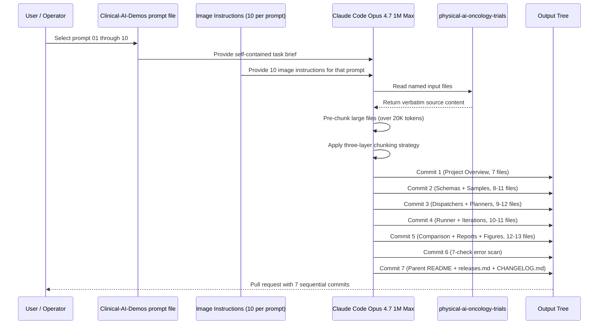

# Demo Projects: Humanoid + LLM Oncology Clinical Trial Prompts

[](https://github.com/kevinkawchak/Clinical-AI-Demos)
[](https://github.com/kevinkawchak/physical-ai-oncology-trials)
[](https://doi.org/10.5281/zenodo.18445179)
[](https://github.com/kevinkawchak/Clinical-AI-Demos/tree/main/demo-projects)
[](https://github.com/kevinkawchak/Clinical-AI-Demos/tree/main/demo-projects/image-instruct)
[](https://opensource.org/licenses/MIT)
[](https://www.python.org/)

Released on 17 May 2026
CEO Kevin Kawchak, ChemicalQDevice

This directory contains 10 standalone Claude Code task brief prompts for downstream Claude Code Opus 4.7 1M Max sessions to author Physical AI oncology clinical trial demonstrations. Every demo features a distinct humanoid platform, an explicit large language model control loop, and a unique perspective spanning surgical, patient care, sponsor operations, pharmacy, pathology, telesurgery, adverse event, research coordination, radiation oncology, and decentralized home care scenarios. As of v0.2.0 the directory also contains 100 image instructions at `image-instruct/` (10 per prompt).

## Why This Directory Exists

The companion repository kevinkawchak/physical-ai-oncology-trials covers end-to-end infrastructure for Physical AI oncology clinical trials (sponsors, sites, regulatory adaptations, federated learning, digital twins, surgical simulations). Clinical-AI-Demos covers the next layer: the wide-scope demonstrations that humanoid agents perform inside that infrastructure. Each prompt in this directory is a self-contained task brief that a future Claude Code Opus 4.7 1M Max session reads to author a complete simulation across seven sequential commits in a single pull request.

## Thesis

A new oncology clinical trial industry is forming around humanoid agents and large language models. Surgical robots are evolving toward general-purpose humanoid bodies with 30 to 50 degrees of freedom and 5 to 25 kg per-arm payload. Frontier large language models (Claude Opus 4.7, GPT-5.5, Gemini 3) provide the planning and reasoning loop. On-prem and edge LLM deployments (Anthropic Cowork, Ollama Llama 4, NVIDIA GR00T) keep PHI off the public cloud. Every trial site, every pharmaceutical sponsor, every pharmacy clean room, every patient recovery room, every pathology lab, every LINAC vault, every adverse event call, every CRC visit, every home visit gains a humanoid plus an LLM. This directory delivers 10 perspectives on what those deployments look like.

## The 10 Demo Prompts

| # | Demo | Humanoid | LLM | Duration | Resolution |
|---|------|----------|-----|----------|------------|
| 01 | [Humanoid Trial Site Operations Director](01-humanoid-site-operations-director.md) | Boston Dynamics Atlas Electric | Claude Opus 4.7 1M on-prem | 8 hours | 1 s |
| 02 | [Pharmaceutical Sponsor Humanoid Operations Center](02-sponsor-humanoid-operations-center.md) | 5x Tesla Optimus Gen 3 | Claude Sonnet 4.6 + Opus 4.7 cloud failover | 168 hours (1 week) | 1 s |
| 03 | [Humanoid Pharmacy and IMP Compounding](03-humanoid-pharmacy-imp-compounding.md) | Figure 03 | GPT-5.5 Thinking on-prem | 4 hours | 100 ms |
| 04 | [Humanoid Post-Operative Recovery Nurse](04-humanoid-post-op-recovery-nurse.md) | Agility Digit V5 | Claude Haiku/Sonnet + Ollama Llama 4 70B | 24 hours | 1 s |
| 05 | [Humanoid Biospecimen and Pathology Lab Assistant](05-humanoid-biospecimen-pathology-lab.md) | Sanctuary Phoenix Gen 8 | Gemini 3 Pro + Ollama Qwen3 72B via MCP | 12 hours | 100 ms |
| 06 | [Humanoid Tele-Surgical Assistant](06-humanoid-tele-surgical-assistant.md) | Apptronik Apollo | Claude Opus 4.7 1M + operator-in-the-loop | 90 minutes | 1 ms |
| 07 | [Humanoid 24/7 Adverse Event Response Team](07-humanoid-24-7-adverse-event-response.md) | 3x Unitree H2 (4-site rotation) | Per-site Claude Opus 4.7 1M + human escalation | 168 hours (1 week) | 1 s |
| 08 | [Humanoid Clinical Research Coordinator](08-humanoid-clinical-research-coordinator.md) | 1X Neo Beta | Claude + Gemini + GPT ensemble routing | 8 hours | 1 s |
| 09 | [Humanoid Radiation Oncology Technologist](09-humanoid-radiation-oncology-technologist.md) | Atlas + Optimus pair | NVIDIA GR00T N1.6 + Cosmos Reason 2 + Claude arbiter | 8 hours | 100 ms |
| 10 | [Humanoid Decentralized Home Care for DCT](10-humanoid-decentralized-home-care.md) | Figure 03 Field Edition | Claude Haiku 4.5 edge on NVIDIA Orin | 24 hours | 1 s active + 10 s ambient |

## Image Instructions (v0.2.0)

100 image instructions are placed at `image-instruct/`, 10 per prompt across 10 subdirectories. Each instruction specifies one publication-ready 300 dpi matplotlib PNG that a future Claude Code Opus 4.7 1M Max session will author under `demo-projects/NN-name-output/figures/NN-NN-short-name.png`. Distribution per prompt: 3 landscape full-page (system architecture, operational timeline Gantt, regulatory compliance heatmap) plus 7 portrait (value proposition canvas, financial waterfall, capability radar, sankey flow, process funnel, strategic quadrant, decision tree).

| # | Image Instructions Subdirectory | Humanoid + LLM Stack | Landscape | Portrait |
|---|---------------------------------|----------------------|-----------|----------|
| 01 | [image-instruct/01-site-operations-director/](image-instruct/01-site-operations-director) | Atlas Electric + Claude Opus 4.7 1M on-prem | 3 | 7 |
| 02 | [image-instruct/02-sponsor-operations-center/](image-instruct/02-sponsor-operations-center) | 5x Tesla Optimus Gen 3 + Sonnet/Opus failover | 3 | 7 |
| 03 | [image-instruct/03-pharmacy-imp-compounding/](image-instruct/03-pharmacy-imp-compounding) | Figure 03 + GPT-5.5 Thinking on-prem | 3 | 7 |
| 04 | [image-instruct/04-post-op-recovery-nurse/](image-instruct/04-post-op-recovery-nurse) | Digit V5 + Haiku/Sonnet + Llama 4 70B | 3 | 7 |
| 05 | [image-instruct/05-biospecimen-pathology-lab/](image-instruct/05-biospecimen-pathology-lab) | Phoenix Gen 8 + Gemini/Qwen via MCP | 3 | 7 |
| 06 | [image-instruct/06-tele-surgical-assistant/](image-instruct/06-tele-surgical-assistant) | Apollo + Claude Opus 4.7 1M + Operator | 3 | 7 |
| 07 | [image-instruct/07-adverse-event-response/](image-instruct/07-adverse-event-response) | 3x Unitree H2 + Per-Site Claude Opus | 3 | 7 |
| 08 | [image-instruct/08-clinical-research-coordinator/](image-instruct/08-clinical-research-coordinator) | Neo Beta + Claude+Gemini+GPT ensemble | 3 | 7 |
| 09 | [image-instruct/09-radiation-oncology-technologist/](image-instruct/09-radiation-oncology-technologist) | Atlas+Optimus + GR00T+Cosmos+Claude arbiter | 3 | 7 |
| 10 | [image-instruct/10-decentralized-home-care/](image-instruct/10-decentralized-home-care) | Figure 03 Field + Claude Haiku 4.5 on Orin | 3 | 7 |

30 landscape + 70 portrait = 100 image instructions total.

## Coverage Matrix

```
                                          Setting Coverage
              Trial   Sponsor  Pharmacy  Recovery  Patho  Tele  AE   CRC  RadOnc  Home
              Site    HQ                  Room     Lab    Surg  Resp       Vault   DCT
01 Site Dir   X
02 Sponsor    .       X        .          .        .      .     .    .    .       .
03 Pharmacy   .       .        X          .        .      .     .    .    .       .
04 Recovery   .       .        .          X        .      .     .    .    .       .
05 Pathology  .       .        .          .        X      .     .    .    .       .
06 Tele-Surg  .       .        .          .        .      X     .    .    .       .
07 AE Resp    X       X        .          X        .      .     X    .    .       .
08 CRC        X       .        .          .        .      .     .    X    .       .
09 RadOnc     X       .        .          .        .      .     .    .    X       .
10 Home DCT   .       X        .          .        .      .     .    .    .       X
```

```
                                          Humanoid Coverage
              Atlas  Optimus  Figure  Digit  Phoenix  Apollo  Neo  H2  Field  Pair
01 Site Dir   X
02 Sponsor    .      X (5)    .       .      .        .       .    .   .      .
03 Pharmacy   .      .        X       .      .        .       .    .   .      .
04 Recovery   .      .        .       X      .        .       .    .   .      .
05 Pathology  .      .        .       .      X        .       .    .   .      .
06 Tele-Surg  .      .        .       .      .        X       .    .   .      .
07 AE Resp    .      .        .       .      .        .       .    X (3) .   .
08 CRC        .      .        .       .      .        .       X    .   .      .
09 RadOnc     .      .        .       .      .        .       .    .   .      X (Atlas+Optimus)
10 Home DCT   .      .        .       .      .        .       .    .   X      .
```

## Common Prompt Template

Every prompt in this directory follows the same template:

```
1. Title with v0.1.0 release badge, companion badge, DOI badge,
   resolution badge, humanoid badge, LLM badge, Python version badge.
2. Perspective: who is the humanoid, where, when, why, what does it do?
3. Thesis: the on-prem LLM + humanoid solution.
4. Scope: one specific scenario with patient, humanoid, LLM, duration,
   resolution, iteration count.
5. Why a Future Pass: chunking justification.
6. Inputs from physical-ai-oncology-trials: exact file paths with
   purpose statements.
7. Downstream LLM Processing Instructions: step-by-step procedure for
   the future Claude Code Opus 4.7 1M Max session.
8. Future Output Tree: ASCII tree of files the future session authors.
9. Per-Commit Roadmap: 7-commit single-PR breakdown.
10. CI Compliance: ruff + yamllint configuration.
11. Comparison Framework: three-category competitor model with weights.
12. Notes: safety constraints, force limits, E-stop latency budgets,
    PHI handling rules.
```

## How to Run a Prompt

A downstream Claude Code Opus 4.7 1M Max session executes each prompt as follows:

1. Read the prompt file in this directory (e.g., `01-humanoid-site-operations-director.md`).
2. Read the 10 image instruction files in `image-instruct/NN-<short-name>/` for the chart specifications.
3. Clone or update `kevinkawchak/physical-ai-oncology-trials` to read the input files listed under "Inputs from physical-ai-oncology-trials".
4. Pre-chunk any input file over 20K tokens per the chunking strategy in `competitions/instructions/chunking_strategy.md` of the companion repository.
5. Author the output tree under `demo-projects/<NN-name>-output/` (in Clinical-AI-Demos) following the "Future Output Tree" section, including a `figures/` subdirectory populated from the 10 image instructions.
6. Apply the SVG-to-ASCII replacement rule from `competitions/instructions/ascii_diagram_guide.md` for any high-frequency time series.
7. Run the pre-commit checklist: `ruff check .`, `ruff format --check .`, `yamllint -d relaxed .github/`.
8. Commit seven sequential commits in a single PR on a branch named `claude/demo-NN-name-shortid`.
9. The seventh commit updates the main README, releases.md, and CHANGELOG.md.

## ASCII Architecture Diagram

```
                   Clinical-AI-Demos: Humanoid + LLM Demo Prompts
                   ===============================================

  +-------------------+      +-------------------+      +-------------------+
  |   Prompt File +   |      |   Future Claude   |      |   Output Tree     |
  |   Image           |----->|   Code Opus 4.7   |----->|   under demo-     |
  |   Instructions    |      |   1M Max Session  |      |   projects/NN-*-  |
  |   (this dir +     |      +-------------------+      |   output/         |
  |   image-instruct) |               |                +-------------------+
  +-------------------+               |                         |
                                       v                         v
                             +-------------------+      +-------------------+
                             | physical-ai-      |      |   7 Sequential    |
                             | oncology-trials   |      |   Commits in 1 PR |
                             | input files       |      |   on Clinical-AI- |
                             |                   |      |   Demos           |
                             +-------------------+      +-------------------+
                                       |
                  +--------------------+--------------------+
                  |                                         |
                  v                                         v
        +-------------------+                  +-------------------+
        | sponsor/, new-    |                  | competitions/     |
        | trial/, patient-  |                  | instructions/     |
        | journey/, etc.    |                  | chunking pattern  |
        +-------------------+                  +-------------------+
```

## Mermaid Sequence: Prompt Execution



## Safety Constraints Across the 10 Demos

| Demo | E-Stop Latency | Cum. Force Limit | Inter-Humanoid Min Distance | PHI Egress |
|------|---------------|------------------|-----------------------------|------------|
| 01 | 50 ms | 15 N | n/a (1 humanoid) | none |
| 02 | 100 ms | 25 N | 8 mm | gated by Safe Harbor |
| 03 | 5 ms | 8 N | n/a (1 humanoid) | none |
| 04 | 100 ms | 12 N | n/a (1 humanoid) | none (Ollama PHI route) |
| 05 | 10 ms | 10 N | n/a (1 humanoid) | gated by Safe Harbor |
| 06 | 5 ms | 5 N | n/a (1 humanoid) | none |
| 07 | 5 ms | 15 N | n/a (1 humanoid active) | none |
| 08 | 100 ms | 20 N | n/a (1 humanoid) | gated by Safe Harbor |
| 09 | 5 ms | 22 N | 1.5 m | none |
| 10 | 100 ms | 12 N | n/a (1 humanoid) | none (edge LLM only) |

## Regulatory Framework References

Each prompt cites the relevant regulatory framework. Cross-reference:

| Reference | Cited In Demos |
|-----------|---------------|
| 21 CFR Part 50 (Informed Consent) | 04, 06, 08, 10 |
| 21 CFR Part 312 (IND Application) | 03, 05, 10 |
| 21 CFR Part 11 (Electronic Records) | 02, 03, 07, 08 |
| ICH E6(R3) (GCP) | 01, 03, 04, 07, 08 |
| IEC 80601-2-77 (Medical Robot Safety) | 01, 06, 09 |
| IEC 62304 (Software Lifecycle) | 03 |
| HIPAA 45 CFR 164.514(b) (Safe Harbor) | 02, 04, 05, 08, 10 |
| NRC 10 CFR 35 (Medical Use of Byproduct Material) | 09 |
| HR 9501 Patient Self-Selection Act | 08, 10 |
| HR 9502 Robot-and-Humanoid Choice Act | 08, 10 |
| HR 9504 Physical AI Clinical Error Reduction Act | 07 |
| HR 9505 Real-Time Patient-Sponsor Direct Communication Act | 07 |
| HR 9507 Cancer Patient Health Data Self-Custody Act | 08, 10 |
| FDA RTCT April 2026 | 02, 07 |
| AAPM TG-100 (Risk-Informed QM) | 09 |
| AAPM TG-142 (LINAC QA) | 09 |
| USP 800 (Hazardous Drug Handling) | 03 |
| USP 797 (Sterile Compounding) | 03 |
| CAP Q-Probes (Pathology Preanalytical) | 05 |
| CTCAE v5.0 (Adverse Event Grading) | 07 |
| Braden Scale (Pressure Injury Prevention) | 04 |

## File Listing

```
demo-projects/
├── README.md                                            # This file
├── 01-humanoid-site-operations-director.md              # Atlas Electric + Claude Opus
├── 02-sponsor-humanoid-operations-center.md             # 5x Optimus + Sonnet/Opus failover
├── 03-humanoid-pharmacy-imp-compounding.md              # Figure 03 + GPT-5.5 Thinking
├── 04-humanoid-post-op-recovery-nurse.md                # Digit V5 + Claude/Llama 4
├── 05-humanoid-biospecimen-pathology-lab.md             # Phoenix Gen 8 + Gemini/Qwen via MCP
├── 06-humanoid-tele-surgical-assistant.md               # Apollo + Claude Opus + operator
├── 07-humanoid-24-7-adverse-event-response.md           # 3x H2 + per-site Claude Opus
├── 08-humanoid-clinical-research-coordinator.md         # Neo Beta + Claude/Gemini/GPT ensemble
├── 09-humanoid-radiation-oncology-technologist.md       # Atlas+Optimus pair + GR00T/Cosmos/Claude
├── 10-humanoid-decentralized-home-care.md               # Figure Field + Claude Haiku 4.5 on Orin
└── image-instruct/                                      # v0.2.0 100 image instructions
    ├── README.md
    ├── 01-site-operations-director/                     # 10 instructions for prompt 01
    ├── 02-sponsor-operations-center/                    # 10 instructions for prompt 02
    ├── 03-pharmacy-imp-compounding/                     # 10 instructions for prompt 03
    ├── 04-post-op-recovery-nurse/                       # 10 instructions for prompt 04
    ├── 05-biospecimen-pathology-lab/                    # 10 instructions for prompt 05
    ├── 06-tele-surgical-assistant/                      # 10 instructions for prompt 06
    ├── 07-adverse-event-response/                       # 10 instructions for prompt 07
    ├── 08-clinical-research-coordinator/                # 10 instructions for prompt 08
    ├── 09-radiation-oncology-technologist/              # 10 instructions for prompt 09
    └── 10-decentralized-home-care/                      # 10 instructions for prompt 10
```

## Output Tree Footprint

Each prompt produces an output tree under `demo-projects/NN-name-output/`. The future sessions are expected to produce, in aggregate:

- 10 distinct output trees with approximately 70 files each (700 files total)
- 10 figures subdirectories (10 per prompt, 100 PNGs total at 300 dpi)
- Approximately 80 MB of committed Parquet, CSV, JSONL, and Markdown
- Approximately 250 MB of committed 300 dpi PNGs across all 100 figures
- Approximately 12 GB of Zenodo-archived raw telemetry across all 10 demos
- 10 separate releases (v0.3.0 through v1.2.0) with their own release notes
- 10 separate comparison reports ranking the demo's humanoid + LLM stack against baselines

## Notes

- All prompts use single dashes only. No em dashes, no double dashes, no triple dashes.
- ASCII diagrams cap at 80 columns by 60 lines per `competitions/instructions/ascii_diagram_guide.md`.
- All patient identifiers are synthetic. No real PHI is referenced.
- The seven-commit single-PR pattern is documented in `competitions/instructions/pr_workflow.md` of the companion repository.
- CI compliance: `ruff check`, `ruff format --check`, `yamllint -d relaxed .github/` must pass on Python 3.10, 3.11, and 3.12 before any prompt's output PR is merged.
- The 100 image instructions at `image-instruct/` use a shared color palette and DejaVu Sans typography so all 100 future figures read consistently to any viewer. Single dashes only; section sign § for regulatory citations; no em dashes; no emoji; no dark mode; white facecolor for every PNG.
