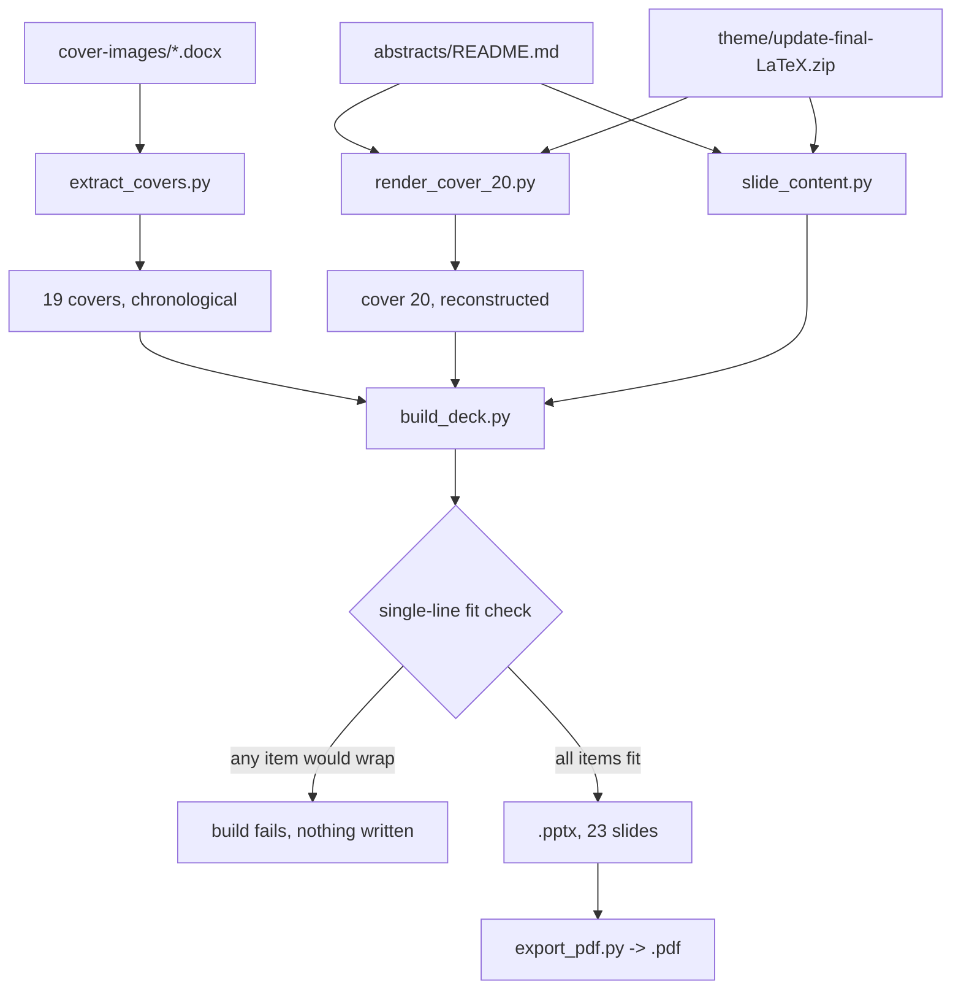

# pdac-presentation/build - the reproducible deck build (v0.9.0)

[](../../releases.md)
[](#the-five-modules)
[](#the-single-line-fit-check)
[](../../ruff.toml)
[](https://www.python.org/)
[](#dependencies)

**Five Python modules that turn a Word document of cover pages, a corpus of
deposited abstracts, and a LaTeX trial-system paper into a 23-slide seminar deck
and its PDF handout. Every step is deterministic and rerunnable from a clean
checkout.**

---

## The five modules

| Module | Reads | Writes |
|:--|:--|:--|
| [`extract_covers.py`](extract_covers.py) | `cover-images/ChemicalQDevice-PDAC-Covers-13Aug26.docx` | 19 JPEG covers into `cover-images/extracted/` |
| [`render_cover_20.py`](render_cover_20.py) | The deposited front matter of 10.5281/zenodo.21887807 | `cover-20-independent-scientist-to-novel-performer.jpg` |
| [`slide_content.py`](slide_content.py) | Nothing at runtime; it is the authored content | Imported by `build_deck.py` |
| [`build_deck.py`](build_deck.py) | `slide_content.py` plus the 20 covers | `slides/LLM-Pancreatic-Oncology-Clinical-Trial-System.pptx` |
| [`export_pdf.py`](export_pdf.py) | The `.pptx` | `slides/LLM-Pancreatic-Oncology-Clinical-Trial-System.pdf` |

## Build order



## Running it

```bash
pip install python-pptx pillow

python pdac-presentation/build/extract_covers.py
python pdac-presentation/build/render_cover_20.py
python pdac-presentation/build/build_deck.py
python pdac-presentation/build/export_pdf.py
```

Each module resolves its own paths from `__file__`, so the working directory does
not matter. Each is idempotent: rerunning overwrites its outputs byte for byte,
apart from the JPEG encoder's own nondeterminism, which does not apply here
because the covers are copied rather than re-encoded.

## Dependencies

| Package | Used for |
|:--|:--|
| `python-pptx` | Slide construction, bullet and numbering XML, hyperlink runs |
| `pillow` | Cover aspect ratios, the reconstructed cover page, and font metrics |
| LibreOffice Impress | PDF export only, called as `soffice --headless --convert-to pdf` |

Neither `python-pptx` nor `pillow` is a repository-wide dependency; the CI job
lints this tree but does not execute it, so a contributor without them can still
run `ruff check .` and `ruff format --check .` cleanly.

If LibreOffice Impress is unavailable, `export_pdf.py` fails with an explicit
message and the PDF can be produced from PowerPoint with
**File > Export > Create PDF/XPS** instead. The deck is typed in Arial and Times
New Roman precisely so the two routes agree.

## The single-line fit check

The seminar brief requires every bullet and numbered item to be a single line.
That is a typographic property, not an editorial one, so `build_deck.py` measures
it instead of trusting the author.

`assert_single_line()` runs before any slide is created. For every item it
measures the bold label and the regular body separately, at their real point
sizes, using the metric-compatible Liberation faces that LibreOffice substitutes
for Arial, and compares the total against the narrowest text column that actually
carries a list item. If anything overflows, the build raises `SystemExit` and
lists every offender with its measured and permitted widths:

```
single-line fit check failed:
  paper 12 LLM Trust: 606.5pt > 585.7pt -- Publishing what verification costs ...
```

**When it fires, shorten the copy in `slide_content.py`.** Do not widen the
column, shrink the type, or delete the check: the column width is set by the
cover image, and the point size is set by what a seminar room can read.

The check carries a 2 pt safety margin (`FIT_SAFETY_PT`) so a rounding difference
between the measuring face and the rendering face cannot produce a wrap that the
build reported as passing.

## Layout constants

All geometry lives at the top of `build_deck.py` and nowhere else.

| Constant | Value | Why |
|:--|:--|:--|
| `SLIDE_W` / `SLIDE_H` | 13.333 in / 7.5 in | 16:9 landscape |
| `MARGIN` / `CONTENT_RIGHT` | 0.5 in / 12.833 in | Symmetric side margins |
| `IMAGE_BOX_W` / `IMAGE_BOX_H` | 3.45 in / 5.36 in | Cover fits inside, aspect preserved |
| `COLUMN_GAP` | 0.28 in | Gutter between cover and text column |
| `BODY_PT` / `LABEL_PT` | 12.5 pt | The largest size at which every item stays on one line |
| `BULLET_INDENT` | 0.24 in | Hanging indent for both bullets and numbers |
| `LIST_INSET_L` / `LIST_INSET_R` | 0.14 in / 0.06 in | Identical for both list frames, so bullets align across the panel edge |
| `FIT_SAFETY_PT` | 2.0 | Headroom against font-substitution rounding |

## Typography

| Role | Typeface | Metric clone used for measurement |
|:--|:--|:--|
| Deck title, slide headlines, statistic values | Times New Roman | Liberation Serif |
| Running header, body items, footer, references | Arial | Liberation Sans |

Arial and Times New Roman were chosen over more fashionable faces for one
reason: their metrics are the metrics the fit check can measure, and LibreOffice
substitutes metric-identical clones, so the PDF's line breaks are the line breaks
the check verified. A face without a metric clone would make the PDF a guess.

## Shapes, bullets and numbering

`python-pptx` has no high-level API for bullet glyphs, so `set_bullet()` writes
the DrawingML directly onto the paragraph properties, in schema order:

```xml
<a:pPr marL="219456" indent="-219456">
  <a:lnSpc>...</a:lnSpc>
  <a:spcAft>...</a:spcAft>
  <a:buClr><a:srgbClr val="407CB9"/></a:buClr>
  <a:buFont typeface="Arial"/>
  <a:buChar char="&#9642;"/>            <!-- or <a:buAutoNum type="arabicPeriod" startAt="1"/> -->
</a:pPr>
```

`add_rect()` also strips the `<p:style>` element that `python-pptx` attaches to
every autoshape. That element carries `<a:effectRef idx="2">`, which LibreOffice
honors as a drop shadow even when `spPr` contains an empty `<a:effectLst/>`.
Removing it is what keeps the pale synthesis panel and the accent rules flat.

## Content rules encoded in `slide_content.py`

| Rule | Where it lives |
|:--|:--|
| Four left covers then one right, repeating | `side_for()` and `RIGHT_COVER_EVERY` |
| Framing and synthesis lines are bullets | The `"bullet"` style on those items |
| Strengths, Limitations, Results are a numbered set | The `"number"` style, contiguous, `startAt="1"` |
| A paper may take a second LLM Trust or LLM Benefit line | Any item whose label starts with `LLM ` is routed to the panel |
| Every quantity is sourced | `abstracts/README.md` or `theme/update-final-LaTeX.zip`, nothing estimated |

## Lint

This tree is inside the repository-wide `ruff` scope and is checked on Python
3.10, 3.11 and 3.12 by [`.github/workflows/ci.yml`](../../.github/workflows/ci.yml).

```bash
pip install ruff yamllint
ruff check .
ruff format --check .
yamllint -d relaxed .github/
```

There are no per-file ignores for this directory in [`ruff.toml`](../../ruff.toml).
The one deliberate suppression is `# noqa: E402` on the `slide_content` import in
`build_deck.py`, which necessarily follows the `sys.path` insertion that makes it
importable when the module is run as a script.
