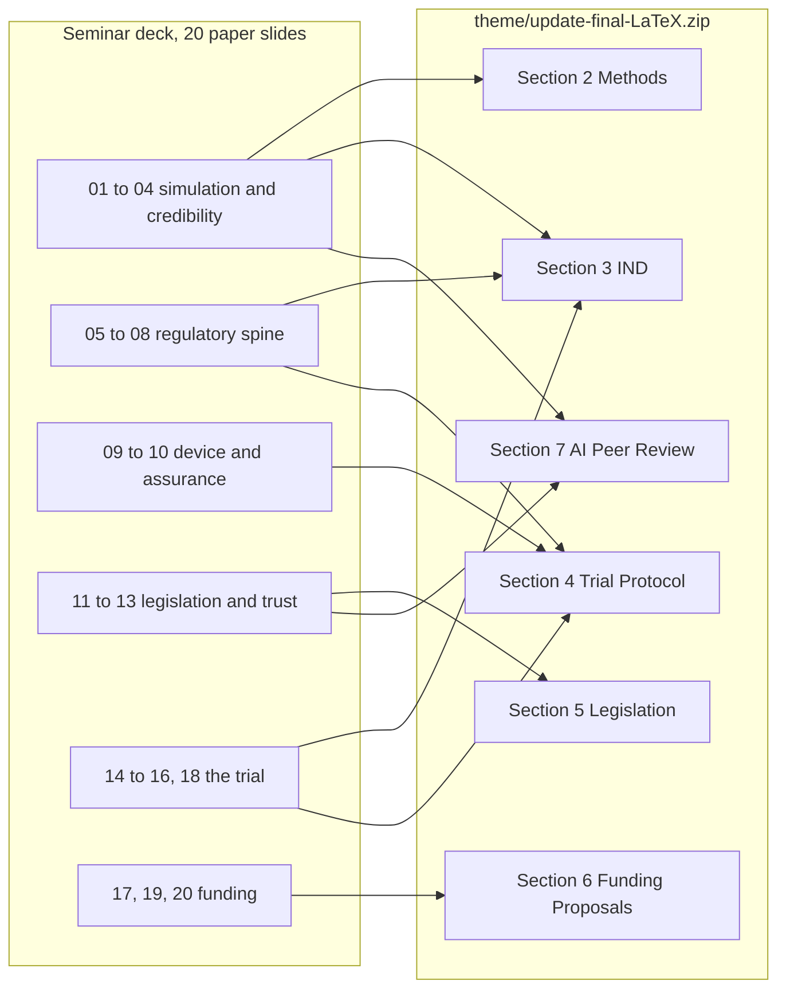

# pdac-presentation/theme - the trial the deck argues for (v0.9.0)

[](../../releases.md)
[](update-final-LaTeX.zip)
[](#what-is-in-the-bundle)
[](#what-is-in-the-bundle)
[](#what-is-in-the-bundle)
[](#compiling-it)
[](#what-is-in-the-bundle)

**The Overleaf bundle of *Pancreatic Cancer LLM Clinical Trial System: From IND
to Protocol to Legislation, Funding, and AI Peer Review*. It is the destination
every LLM Trust and LLM Benefit line on the seminar slides points toward.**

---

## Why this directory exists

The twenty papers on the seminar slides are evidence. This bundle is the claim
they are evidence for. Two of the seven lines on every paper slide are written
against it:

| Slide line | What it is answering |
|:--|:--|
| **LLM Trust** | How did this paper make an LLM-based pancreatic cancer trial more trustworthy than it was before the paper existed? |
| **LLM Benefit** | What does this paper contribute to the Phase 1 LLM-enabled trial described in this bundle? |

Without the bundle, those two lines would be opinion. With it, each one names a
section, a gate, a table or a number that a seminar audience can go and read.

## What is in the bundle

`update-final-LaTeX.zip` is a complete, self-contained Overleaf project. It reads
nothing from a parent directory.

| Path inside the zip | Contents |
|:--|:--|
| `main.tex` | Cover page, badges, DOI, ORCID iD, notices, keywords, contents, eleven `\input` lines |
| `trialstyle.sty` | Palette, float and caption machinery, and five diagram vocabularies |
| `references.bib` | 143 entries, each with a working URL and a DOI where one exists |
| `sections/sec-00-front.tex` | Abstract, reader's guide, figure index, table index |
| `sections/sec-01-introduction.tex` | Eleven Federal AI and cancer actions, January 2025 to July 2026 |
| `sections/sec-02-methods.tex` | The master-prompt build, and what a figure specification stores |
| `sections/sec-03-ind.tex` | The twelve-module IND under 21 CFR 312 and 812 |
| `sections/sec-04-trial-protocol.tex` | The Phase 1 and Phase 2 protocols |
| `sections/sec-05-legislation.tex` | Five bill versions and four companion documents |
| `sections/sec-06-funding-proposals.tex` | The ten applications and the capitalization plan |
| `sections/sec-07-ai-peer-review.tex` | Four quantified costs of the prior regime, three the new one removes |
| `sections/sec-08-limitations-future-work.tex` | Remaining exposures and what mitigates each |
| `sections/sec-09-conclusions.tex` | The incompatibility claim and the funding ask |
| `sections/sec-10-references-backmatter.tex` | Back matter and glossary |

Eleven sections, twenty-five figures, twenty-five tables, 53 pages under
pdfLaTeX. No raster image appears anywhere in the bundle: every figure is a
specification file that is re-read rather than re-drawn.

## The numbers the seminar deck quotes from it

| Quantity | Where it appears in the deck |
|:--|:--|
| Twelve IND modules, 594,657 characters, 22 figures, 84 tables, 52 cross-references, four days | Title slide, and paper 16 |
| Phase 1 at n = 18, 3+3 escalation, behind a Phase 0 gate of at least 1000 simulations across two frameworks | Title slide, and paper 14 |
| Phase 2 at n = 220 across eight high-volume centers, hazard ratio 0.60 | Paper 15 |
| 369,299 characters and 42 figures across both protocols, deposited two days apart | Paper 14 |
| $306,000 Phase I, $1,300,000 Phase II, $1,606,000 award, $3,500,000 five-year direct program | Title slide, and paper 20 |
| $1,396,000 of direct work inside the award, $2,104,000 outside it | Paper 20 |
| 15.0 percent company load against $2,137,000 for identical direct work at a 57 percent university rate | Paper 20 |
| $5,900,000 of private capital above the firewall at 3.67 to one | Paper 20 |
| Ten funding mechanisms: NIH Pioneer, ARPA-H, NSF TIP X-Labs, DOE Genesis, NIH SEED SBIR, FNIH AMP, HHMI, NCI CTEP, Convergent Research FRO, UC San Diego Moores | Paper 19 |
| Seven to eight weeks best case and several months typical for a human review round, against three model manufacturers reporting the same day | The deck's premise throughout |

## How the deck maps papers onto sections



## Compiling it

Upload `update-final-LaTeX.zip` to Overleaf and select pdfLaTeX, or build locally:

```bash
unzip update-final-LaTeX.zip -d update-final
cd update-final
pdflatex main
bibtex  main
pdflatex main
pdflatex main
```

The bundle sets in 53 pages with no error, no undefined citation, no undefined
reference, no bibtex warning, and no overfull box above 5 pt.

## Provenance

The bundle is the update stage over stage 8 of the `new-trial-system` tree in the
companion repository
[kevinkawchak/physical-ai-oncology-trials](https://github.com/kevinkawchak/physical-ai-oncology-trials).
Its own `README.md`, carried inside the zip, records what that stage changed and
why, including the three `\foreach` headers whose digit-suffixed iteration macros
had prevented the prior stage from producing a PDF at all.

## Disclaimer

Independent research. Not medical or regulatory advice, and not endorsed by the
FDA, NIH, HHS, an IRB, ICH, or any sponsor. Nothing in the bundle is an approved
protocol, an active IND, or an enacted statute.
